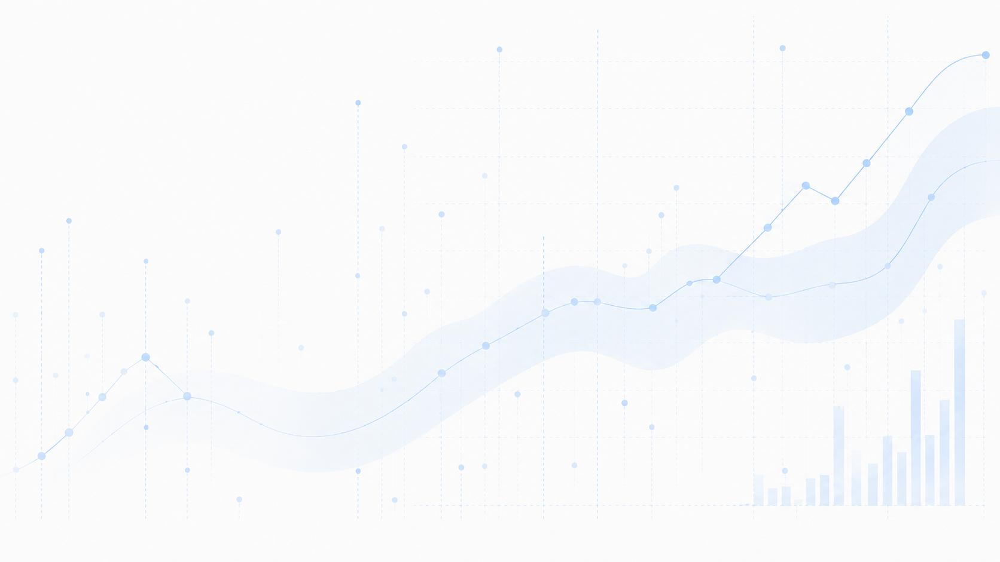
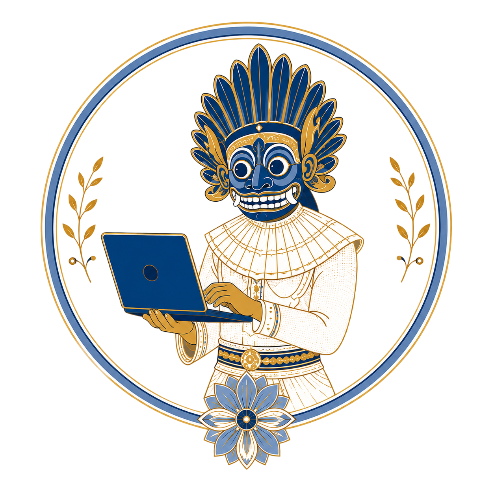

<section class="about-page">

<aside class="about-side">

<a class="cv-button" href="resume_harsha.pdf" target="_blank" rel="noopener">
<i class="bi bi-download"></i>
Download CV
</a>

<a href="mailto:hewagehrc@gmail.com"><i class="bi bi-envelope-fill"></i>E-mail</a>
<a href="https://github.com/chamara7h" target="_blank" rel="noopener"><i class="bi bi-github"></i>GitHub</a>
<a href="https://www.linkedin.com/in/harshachamara/" target="_blank" rel="noopener"><i class="bi bi-linkedin"></i>LinkedIn</a>

<a class="about-scholar-link" href="https://scholar.google.com/citations?user=XgQYqK8AAAAJ&hl=en" target="_blank" rel="noopener"><i class="bi bi-bookmark-star-fill"></i>Google Scholar</a>

</aside>

<main class="about-main">
<section class="about-intro">

About

Forecasting researcher and educator

I am a PhD student at the Data Lab for Social Good research group at Cardiff University, UK. My research focuses on improving forecasting methodologies for family planning supply chains in developing countries, with the goal of enhancing their efficiency and accessibility. In addition to my PhD work, I serve as the Coordinator at the <a href="https://www.cardiff.ac.uk/research/explore/research-units/data-lab-for-social-good">Data Lab for Social Good</a>.

I also lead the research network at <a href="https://forecasters.org/programs/communities/forecasting-for-social-good-f4sg/">Forecasting for Social Good (F4SG)</a>, an official section of the International Institute of Forecasters. As part of this role, I manage the <a href="https://github.com/chamara7h/F4SG">Learning Labs</a> workshop series, providing free training on forecasting methodologies using R and Python. I am passionate about leveraging data science and forecasting techniques to address global challenges.

I collaborate closely with organizations such as USAID, the Ethiopian Pharmaceutical Supply Service, and the HISP Centre at the University of Oslo, translating research into operational tools that improve public health outcomes.

Explore my <a href="https://scholar.google.com/citations?user=XgQYqK8AAAAJ&hl=en" target="_blank" rel="noopener">full list of publications</a> on Google Scholar.

</section>
</main>

<section class="wes-section">

<h2>Why Wes Muna?</h2>

The visual identity of this website is inspired by traditional Sri Lankan Wes Muna motifs.

I wanted the site to reflect not only my research interests, but also where I come from. Traditional practices such as Sanni Yakuma and Kolam were not only performances; they also created spaces for communities to respond to illness, fear, and social tension. For me, that connects naturally with the idea of social good and with my work on public health, forecasting, and practical decision-making.

</section>
</section>
