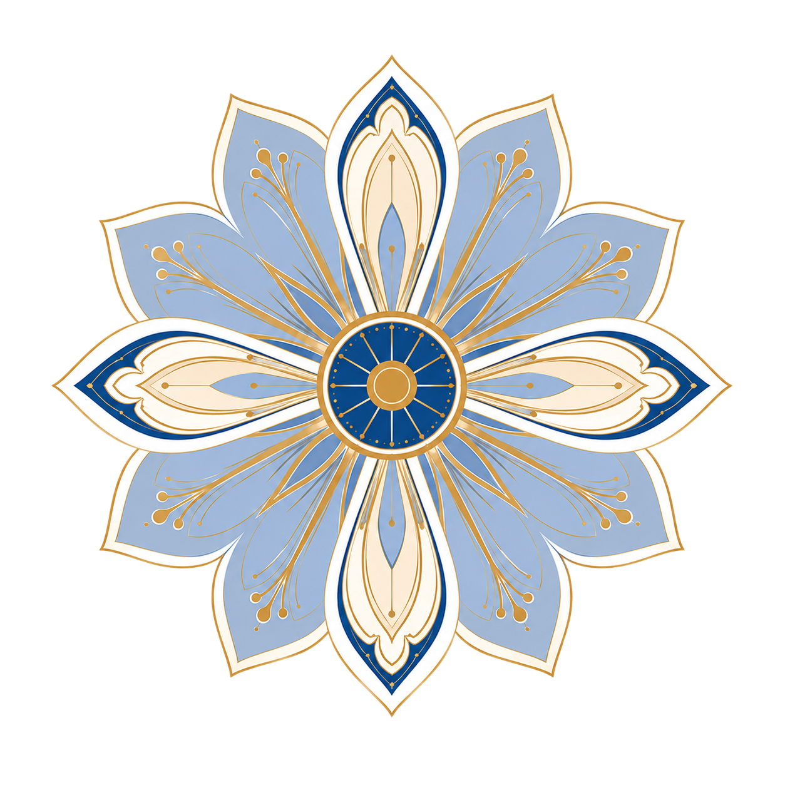
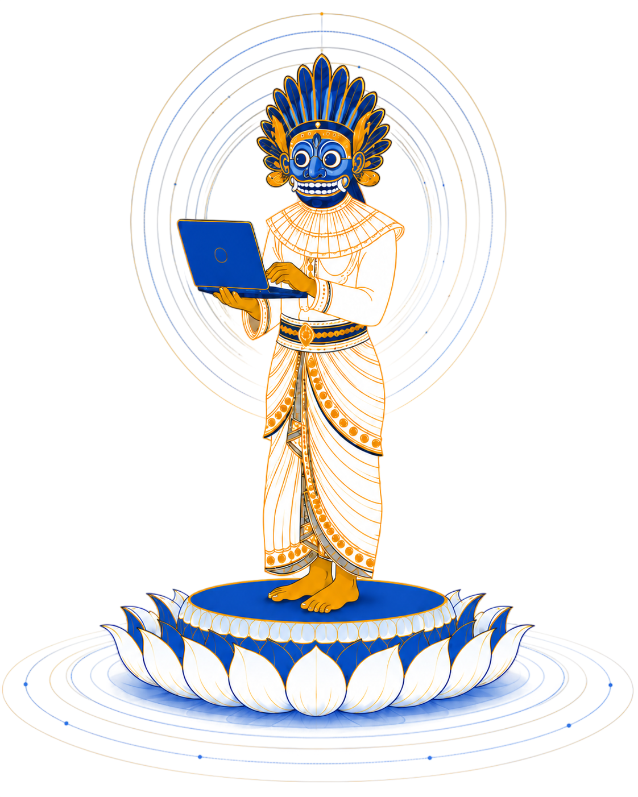
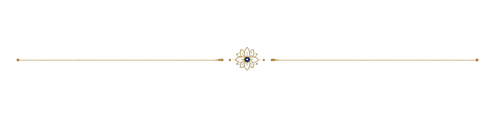

<section class="landing-page">

Harsha Halgamuwe Hewage

I work on forecasting for social good, uncertainty, and decision-making, turning data into practical tools and learning materials for real-world problems.

<a href="mailto:hewagehrc@gmail.com" aria-label="E-mail"><i class="bi bi-envelope"></i></a>
<a href="https://github.com/chamara7h" aria-label="GitHub"><i class="bi bi-github"></i></a>
<a href="https://www.linkedin.com/in/harshachamara/" aria-label="LinkedIn"><i class="bi bi-linkedin"></i></a>
<a href="https://scholar.google.com/citations?user=XgQYqK8AAAAJ&hl=en" aria-label="Google Scholar"><i class="bi bi-bookmark-star-fill"></i></a>

<a href="about/"><i class="bi bi-person-fill"></i>About</a>
<a href="projects/"><i class="bi bi-bar-chart-fill"></i>Projects</a>
<a href="lab/"><i class="bi bi-mortarboard-fill"></i>Learning Lab</a>
<a href="talks/"><i class="bi bi-mic-fill"></i>Talks</a>

Design inspired by traditional Sri Lankan Wes Muna motifs, which I connect with healing, community care, and the social good spirit behind my work.

</section>
