---
format: 
  revealjs:
    slide-number: c/t
    width: 1920
    height: 1080
    logo: "images/logo.png"
    footer: "[Modelling prediction uncertainty](https://chamara7h.github.io/labs/)"
    css: theme.css
    echo: true
execute:
  warning: false
  echo: false
header-includes:
  - '<link rel="stylesheet" href="https://cdnjs.cloudflare.com/ajax/libs/font-awesome/6.4.0/css/all.min.css">'
---   

# {.title-slide background-image="images/cover.png" background-size="cover"}

<div class="logo-container">
  
</div>

<div class="title-slide">
  <h1>Modelling forecast uncertainty</h1>
  <h2>A Practical Guide to Model-Based, Bootstrap, and Conformal Prediction in R</h2>
  <p class="author">Harsha Halgamuwe Hewage</p>
  <p class="author">Data Lab for Social Good Research Group, Cardiff University UK</p>
  <p class="date">2026/02/25</p>
</div>


```{r}
#| include: false

required_packages <- c(
  "tidyverse",
  "ggthemes",
  "tsibble",
  "feasts",
  "fable",
  'distributional',
  'conformalForecast',
  'forecast'
)

new_packages <- required_packages[!required_packages %in% installed.packages()[, "Package"]]
if (length(new_packages)) {
  install.packages(new_packages)
}

invisible(lapply(required_packages, library, character.only = TRUE))

```

## {} 

:::: {.columns}

::: {.column width="40%"}
{.absolute top="-10%" left="-10%" height="120%" style="max-height: unset;"}
:::

::: {.column width="2.5%"}

:::

::: {.column width="57.5%"}

<br>

[What we will cover]{.highlight-title}

::: {.step data-step="01"}
<div class="step-content">
  <p>Why point forecasts fail and the necessity of quantifying risk</p>
</div>
:::

::: {.step data-step="02"}
<div class="step-content">
  <p>Model-Based Approaches: Using standard deviations and parametric assumptions</p>
</div>
:::

::: {.step data-step="03"}
<div class="step-content">
  <p>Bootstrapping: Generating sample paths to simulate complex, non-normal risks and "possible futures"</p>
</div>
:::

::: {.step data-step="04"}
<div class="step-content">
  <p>Conformal Prediction: Using calibration sets to create model-agnostic intervals with statistical guarantees</p>
</div>
:::

::: {.step data-step="05"}
<div class="step-content">
  <p>Comparative guide on picking the right method for your specific data challenges</p>
</div>
:::

:::

::::

## Assumptions

-   **Technical Setup:** You must have **R** and **RStudio** installed and be comfortable with basic coding syntax.
-   **Version Control:** You should be able to use **git** to clone the workshop repository.
-   **No Proofs:** This is **not** a theory-based course, we will not derive formulas or mathematical proofs for convergence.
-   **Practical Focus:** Our goal is applied **Uncertainty Quantification**: understanding *when* to use specific tools to assess risk effectively.

## What we will [not cover]{.highlight-blue}

-   **Deep Theory:** Detailed mathematical derivations or proofs of coverage guarantees.
-   **Different Distributions:** Deep dives into specific distribution types (e.g., Poisson, Negative Binomial) beyond the fundamental Normal vs. Empirical distinction.
-   **Advanced Variants:** We will not cover complex variations like Sieve Bootstrap or Adaptive Conformal Inference in depth.
-   **Model Tuning:** We assume you can fit a basic model; we focus strictly on quantifying the *errors* of that model.
- **Performance Evaluation:** In this session, we will not cover how to evaluate probabilistic forecasts.

## Materials

You can find the workshop materials [here](https://chamara7h.github.io/lab/).

<br>


## {.center background-color="#242B4A"}

[What is wrong with point forecasts?]{.big}

## The illusion of certainty in disease forecasting


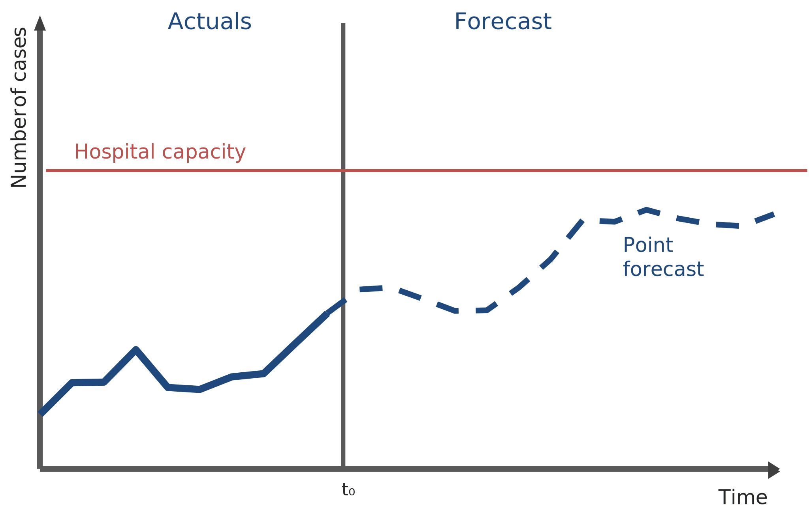


- A point forecast is typically just the [mean]{.highlight-blue} or [median]{.highlight-blue} of a distribution.

::: {.fragment fragment-index=1}

- In public health, the cost of being wrong is not symmetrical. 

:::

::: {.fragment fragment-index=2}

- Over-estimating cases might waste some supplies or under-estimating cases (missing an outbreak) costs lives.

:::

::: {.fragment fragment-index=3}

- Point forecasts are of almost no value without accompanying prediction intervals because [they tell you nothing about the probability of exceeding critical thresholds.]{.highlight-blue}

:::

## From "Will it happen?" to "What is the probability?"


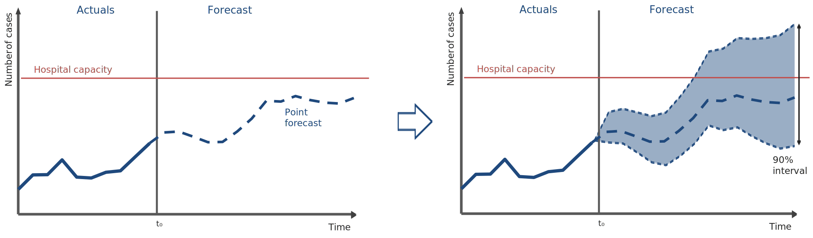

- We move from guessing a specific number to defining a range (e.g., 90% likely to fall between 100 and 500 cases).

::: {.fragment fragment-index=1}
- Climate data (rainfall, temperature) is inherently noisy and non-stationary.
:::

::: {.fragment fragment-index=2}
- As climate volatility increases, the uncertainty in our disease models expands.
:::

::: {.fragment fragment-index=3}
- We do not prepare for the mean scenario; we prepare for the extreme scenario. Uncertainty quantification allows us to ask: [What is the probability we exceed hospital bed capacity?]{.highlight-blue}
:::


## {.center background-color="#242B4A"}

[Moving from **"What is the number?"** to **"What is the risk?"** using uncertainty quantification.]{.big}


## Types of uncertainty output

:::: .{columns}


::: {.column width="32%"}

::: {.fragment}

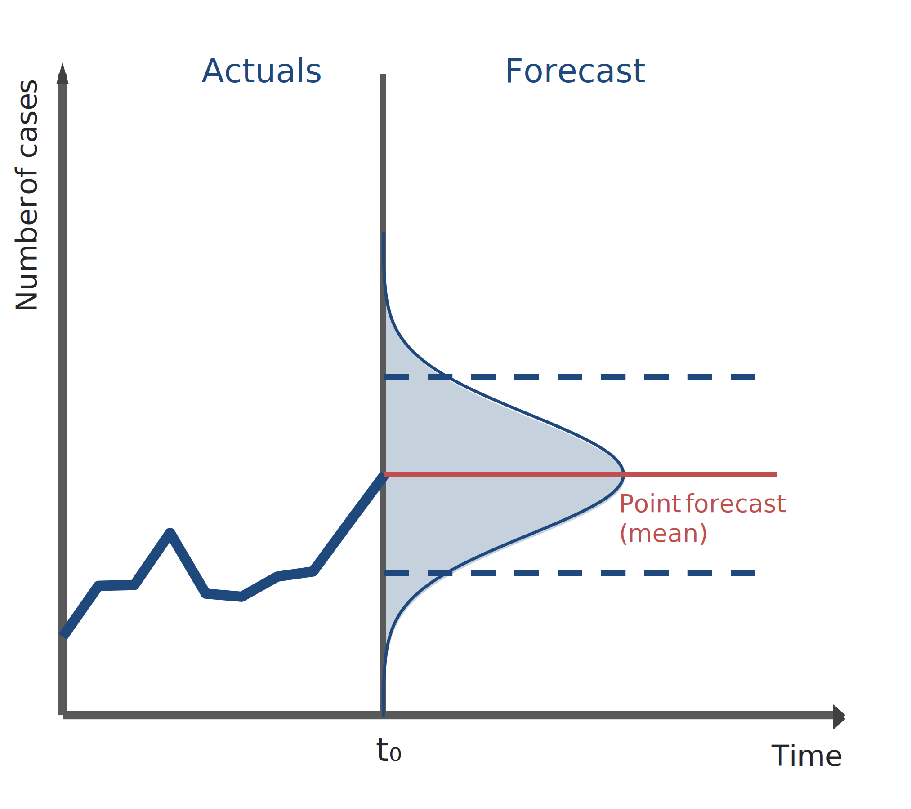

 **Distributions**
 
The full range of possible future case counts, capturing the full range of potential outcomes across all time horizons. The point forecast is just the “typical” outcome.
 
:::

:::

::: {.column width="2%"}

:::

::: {.column width="32%"}

::: {.fragment}

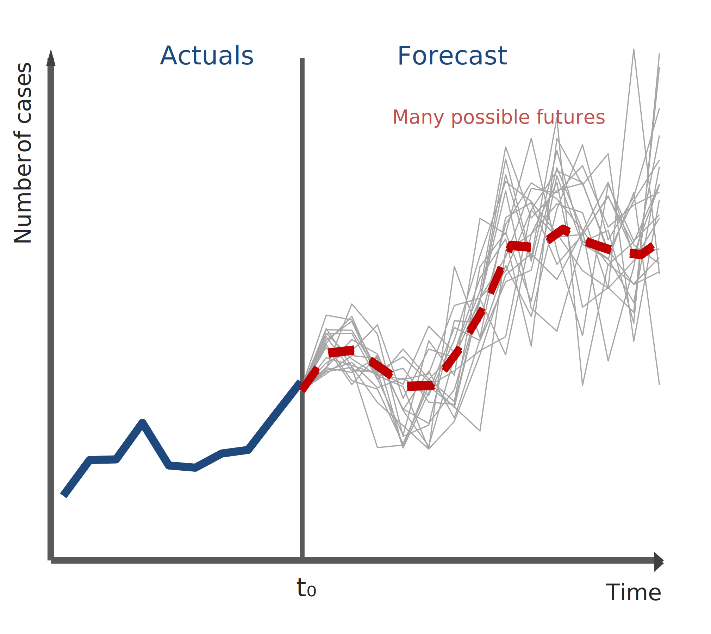

**Sample Paths**

Many simulated “possible futures” that help you see what could happen and summarize risk for totals, peaks, or other real-world planning questions.

:::

:::

::: {.column width="2%"}

:::

::: {.column width="32%"}

::: {.fragment}

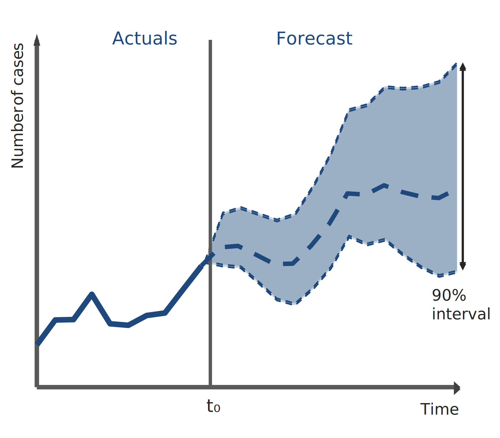

**Prediction Intervals**

A range (e.g., 95%) that shows where cases are likely to fall, helping you plan for high-demand scenarios, not just the average.

:::

:::

::::

## {} 

:::: {.columns}

::: {.column width="40%"}
{.absolute top="-10%" left="-10%" height="120%" style="max-height: unset;"}
:::

::: {.column width="2.5%"}

:::

::: {.column width="57.5%"}

[Uncertainty estimation in forecasting]{.highlight-title}

::: {.fragment fragment-index=0}

<i class="fa-solid fa-check-circle" style="color:#156082; font-size:36px;"></i> **Model-based Approaches**

- Examples: ARIMA/state-space models 
- Assumption: Explicit parametric error distribution

:::

::: {.fragment fragment-index=1}

<i class="fa-solid fa-check-circle" style="color:#156082; font-size:36px;"></i> **Model-agnostic Approaches**

- Bootstrap: Residual bootstrap, block bootstrap
- Conformal predictions

:::

::: {.fragment fragment-index=2}

<i class="fa-solid fa-check-circle" style="color:#156082; font-size:36px;"></i> **Bayesian Approaches**

- Bayesian: Posterior predictive distribution
- Depend on prior / resampling scheme

:::

::: {.fragment fragment-index=3}

<i class="fa-solid fa-check-circle" style="color:#156082; font-size:36px;"></i> **Model-dependent / Heuristic Approaches**

- Quantile regression, ML-based quantile models 
- Heuristic ML: Ensembles, MC dropout

:::

:::

::::


## {} 

:::: {.columns}

::: {.column width="40%"}
{.absolute top="-10%" left="-10%" height="120%" style="max-height: unset;"}
:::

::: {.column width="2.5%"}

:::

::: {.column width="57.5%"}

[Uncertainty estimation in forecasting]{.highlight-title}


<i class="fa-solid fa-check-circle" style="color:#156082; font-size:36px;"></i> [**Model-based Approaches**]{.green}

- [Examples: ARIMA/state-space models ]{.green}
- [Assumption: Explicit parametric error distribution]{.green}

<i class="fa-solid fa-check-circle" style="color:#156082; font-size:36px;"></i> [**Model-agnostic Approaches**]{.green}

- [Bootstrap: Residual bootstrap, block bootstrap]{.green}
- [Conformal predictions]{.green}


<i class="fa-solid fa-check-circle" style="color:#156082; font-size:36px;"></i> **Bayesian Approaches**

- Bayesian: Posterior predictive distribution
- Depend on prior / resampling scheme


<i class="fa-solid fa-check-circle" style="color:#156082; font-size:36px;"></i> **Model-dependent / Heuristic Approaches**

- Quantile regression, ML-based quantile models 
- Heuristic ML: Ensembles, MC dropout


:::

::::

## {.center background-color="#242B4A"}

[01]{.bigger} 

[Model-based approaches using ARIMAX]{.big}

## Forecast distributions

In model-based approaches, we do not simulate future paths one by one. Instead, we assume that the forecast errors (residuals) follow a specific probability distribution.

- A forecast $\hat{y}_{T+h \mid T}$ is (usually) the mean of the conditional distribution  
  $y_{T+h} \mid y_{1}, \ldots, y_{T}$.

- Most time series models produce normally (i.e., Gaussian) distributed forecasts.

- The forecast distribution describes the probability of observing any future value.

:::: {.columns}

::: {.fragment}

::: {.column width="40%"}

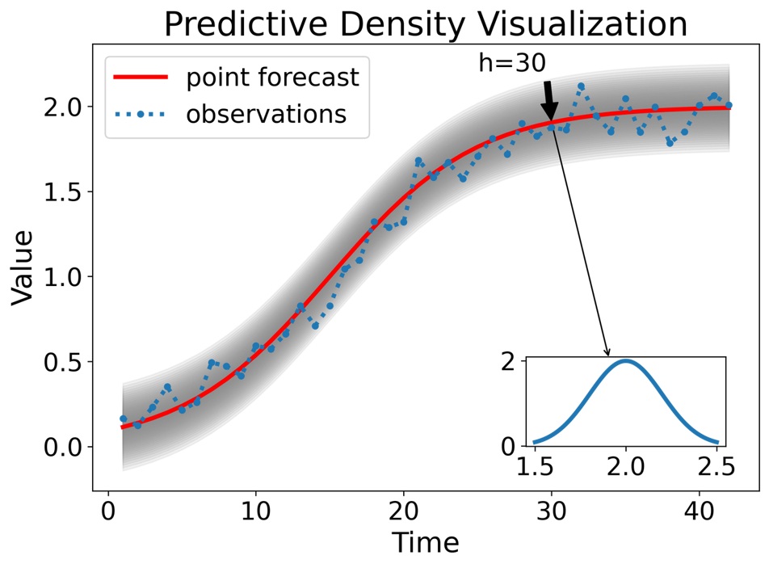
:::

::: {.column width="2.5%"}

:::

::: {.column width="57.5%"}

<br>
<br>

The model estimates the "center" (point forecast) and the "spread" (standard deviation) mathematically.

*   **The Center ($\hat{y}$):** The mean of the distribution.

*   **The Spread ($\sigma_h$):** The standard deviation of the forecast errors at horizon $h$.

:::

:::

::::

## Forecast distributions using `fable` in `R`

Load Libraries

```{r}
#| echo: true
#| code-fold: true

library(fable)
library(tsibble)
library(tidyverse)
library(distributional)
library(conformalForecast)
library(forecast)

```

Load data and create the tsibble

```{r}
#| echo: true
#| code-fold: true

brazil_dengue <- read_csv('data/brazil_dengue.csv')

# make a tissble

brazil_dengue_tsb <- brazil_dengue |> 
  mutate(time_period = yearmonth(time_period)) |> 
  as_tsibble(index = time_period, key = location)

```

Explore the timeseries plot

```{r}
#| echo: true
#| code-fold: true
#| fig-width: 18
#| fig-height: 10
#| output-location: slide

brazil_dengue_tsb |> 
  filter(location == 'Bahia') |> 
  autoplot(disease_cases) +
  labs(
    x = "Month",
    y = "Disease Cases"
  ) +
  theme_minimal(base_family = "Inter", base_size = 40) +
  theme(panel.border = element_rect(color = "lightgrey", fill = NA))

```

## Forecast distributions using `fable` in `R`

Create `train` (2010 Jan - 2015 Dec) and `test` (2016 Jan - 2016 Dec) samples

```{r}
#| echo: true
#| code-fold: true

brazil_dengue_tsb_train <- brazil_dengue_tsb |> 
  filter_index(. ~ '2015 Dec')

brazil_dengue_tsb_future <- brazil_dengue_tsb |> 
  filter_index('2016 Jan' ~ .) |> 
  select(-disease_cases)

```

Fit `ARIMAX` model using `disease_cases` as target variable and `rainfall` and `temperature` as predictors

```{r}
#| echo: true
#| code-fold: true

# model fitting
fit_arimax <- brazil_dengue_tsb_train |> 
  filter(location == 'Bahia') |>
  model(arimax = ARIMA(disease_cases ~ rainfall + mean_temperature))

# producing forecasts
fc_arimax <- fit_arimax |> 
  forecast(new_data = brazil_dengue_tsb_future)

```

Visualise forecast distribution

```{r}
#| echo: true
#| code-fold: true
#| fig-width: 18
#| fig-height: 10
#| output-location: slide

fcst <- fc_arimax |> 
  mutate(disease_cases = distributional::dist_truncated(disease_cases, lower = 0), .mean=mean(disease_cases))

fitted_arimax <- fit_arimax |> augment()

ggplot(data = fcst, mapping = aes(x = time_period, ydist = disease_cases))+
  ggdist::stat_halfeye(alpha = .4) +
  geom_line(aes(y=.mean, colour ="Point Forecast"), linewidth = 1.75) +
  geom_line(aes(y = .fitted, colour ="Fitted"), linewidth = 1.75, data = filter_index(fitted_arimax, "2015 Jan" ~ .)) +
  geom_point(aes(y = .fitted, colour ="Fitted"), linewidth = 1.75, data = filter_index(fitted_arimax, "2015 Jan" ~ .)) +
  geom_line(aes(y = disease_cases, colour ="Actual"), linewidth = 1.75, data = filter_index(brazil_dengue_tsb |> filter(location == 'Bahia'), "2016 Jan" ~ .)) +
  geom_point(aes(y = disease_cases, colour ="Actual"), data = filter_index(brazil_dengue_tsb |> filter(location == 'Bahia'), "2016 Jan" ~ .))+
  scale_color_manual(name=NULL,
                     breaks=c('Fitted', 'Actual',"Point Forecast"),
                     values=c('Fitted'='#E69F00', 'Actual'='#0072B2',"Point Forecast"="#000000"))+
  theme_minimal(base_family = "Inter", base_size = 40) +
  theme(panel.border = element_rect(color = "lightgrey", fill = NA))

```
## {.center background-color="#242B4A"}

[Now it is your turn.]{.bigger}

```{r}
#| echo: false

countdown::countdown(minutes = 10, seconds = 00)
```


## Prediction intervals

- A prediction interval gives a region within which we expect $y_{T+h}$ to lie with a specified probability.

- Assuming forecast errors are normally distributed, then a 95% PI is

$$
\hat{y}_{T+h \mid T} \pm 1.96\,\hat{\sigma}_h
$$

where $\hat{\sigma}_h$ is the standard deviation of the $h$-step-ahead forecast distribution.

- When $h = 1$, $\hat{\sigma}_h$ can be estimated from the residuals.


:::: {.columns}

::: {.fragment}

::: {.column width="40%"}

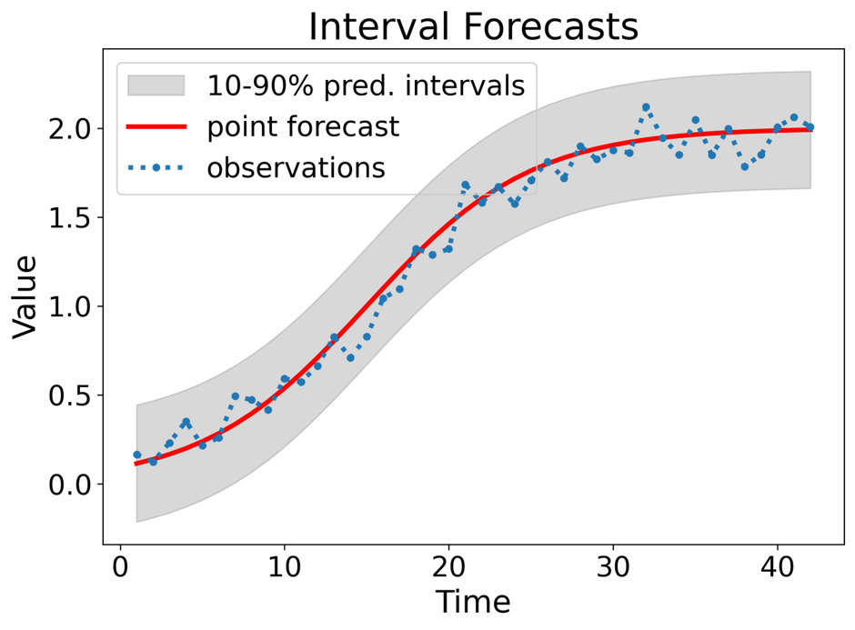
:::

::: {.column width="2.5%"}

:::

::: {.column width="57.5%"}

<br>
<br>

- Prediction intervals require a stochastic model (with random errors, etc.).

- For most models, prediction intervals get wider as the forecast horizon increases.

- Check residual assumptions before believing them.

:::

:::

::::

## Prediction intervals using `fable` in `R`

Forecast intervals can be extracted using the `hilo()` function

```{r}
#| echo: true
#| code-fold: true

fit_arimax |> 
  forecast(new_data = brazil_dengue_tsb_future) |> 
  hilo() |> 
  select(location, .model, .mean, `80%`, `95%`) |> 
  head(6)

```

## Prediction intervals using `fable` in `R`

Use `level` argument to control coverage.

```{r}
#| echo: true
#| code-fold: true

fit_arimax |> 
  forecast(new_data = brazil_dengue_tsb_future) |> 
  hilo(level = 90) |> 
  select(location, .model, .mean, `90%`) |> 
  unpack_hilo("90%") |> 
  head(3)

```

Visualise the prediction intervals

```{r}
#| echo: true
#| code-fold: true
#| fig-width: 18
#| fig-height: 10
#| output-location: slide

fit_arimax |> 
  forecast(new_data = brazil_dengue_tsb_future) |> 
  autoplot(brazil_dengue_tsb |> 
             filter(location == 'Bahia') |>
             filter_index('2015 Jan' ~ .)) +
  theme_minimal(base_family = "Inter", base_size = 40) +
  theme(panel.border = element_rect(color = "lightgrey", fill = NA))

```
## {.center background-color="#242B4A"}

[Now it is your turn.]{.bigger}

```{r}
#| echo: false

countdown::countdown(minutes = 10, seconds = 00)
```

## Key assumptions

1.  **Normality:** The forecast errors (residuals) follow a symmetric Bell Curve.
2.  **Uncorrelated:** The model has captured all signal; the remaining errors have no pattern (white noise).
3.  **Homoscedasticity:** The volatility (variance) of errors is constant over time and does not explode during specific seasons.
4. **Best for:** Stable, high-volume data where you need a quick, standard answer.

::: {.table-custom}

| Pros | Cons | When to Select |
| :--- | :--- | :--- |
| **Speed & Standardization:** Instant calculation using analytic formulas (e.g., $\pm 1.96\sigma$). It is the default output in almost all software, making it easy to reproduce and audit. | **Symmetry Assumption:** Assumes errors are symmetric. For low disease counts, this often produces physically impossible negative lower bounds. | **High-Volume Data:** When case counts are high (e.g., >100/month) and the distribution looks roughly Bell-shaped. |
| **Stability:** Performs reliably on data that is consistent, has a long history, and follows standard seasonal patterns. | **Underestimated Risk:** Often too narrow because it ignores parameter uncertainty (the risk that the model parameters themselves are slightly wrong). | **Short Horizons:** For 1-step ahead forecasts where the "fan" of uncertainty hasn't had time to compound or break down. |
| **Simplicity:** Easy to explain to stakeholders as a "standard statistical range." | **Tail Sensitivity:** If the data has "fat tails" (extreme outbreaks), the Normality assumption fails, and a 95% interval will not actually cover 95% of events. | **Establishing a Baseline:** Use this first to set a benchmark. If complex methods don't beat this, stick with this. |

:::


## {.center background-color="#242B4A"}

[02]{.bigger} 

[Bootstrapping time series]{.big}

## Forecast sample paths (Bootstrapping)

When a Normal distribution for the residuals is an unreasonable assumption (e.g., extreme outbreaks, skewed data), we use **bootstrapping**. This assumes that "future errors will look like past errors".

-   Instead of using a fixed formula, we simulate $B$ different "possible futures" (sample paths) by randomly sampling from past residuals.

:::: {.columns}

::: {.column width="32%"}

::: {.fragment}

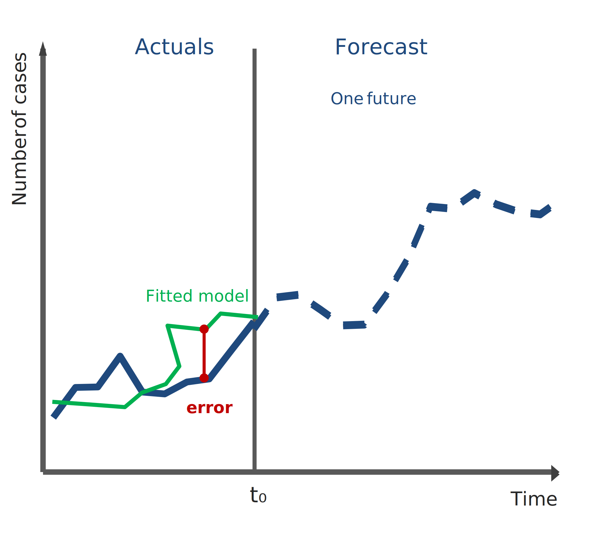

**Resample:** Take a random error ($e^*$) from the past.

:::

:::

::: {.column width="2%"}

:::

::: {.column width="32%"}

::: {.fragment}

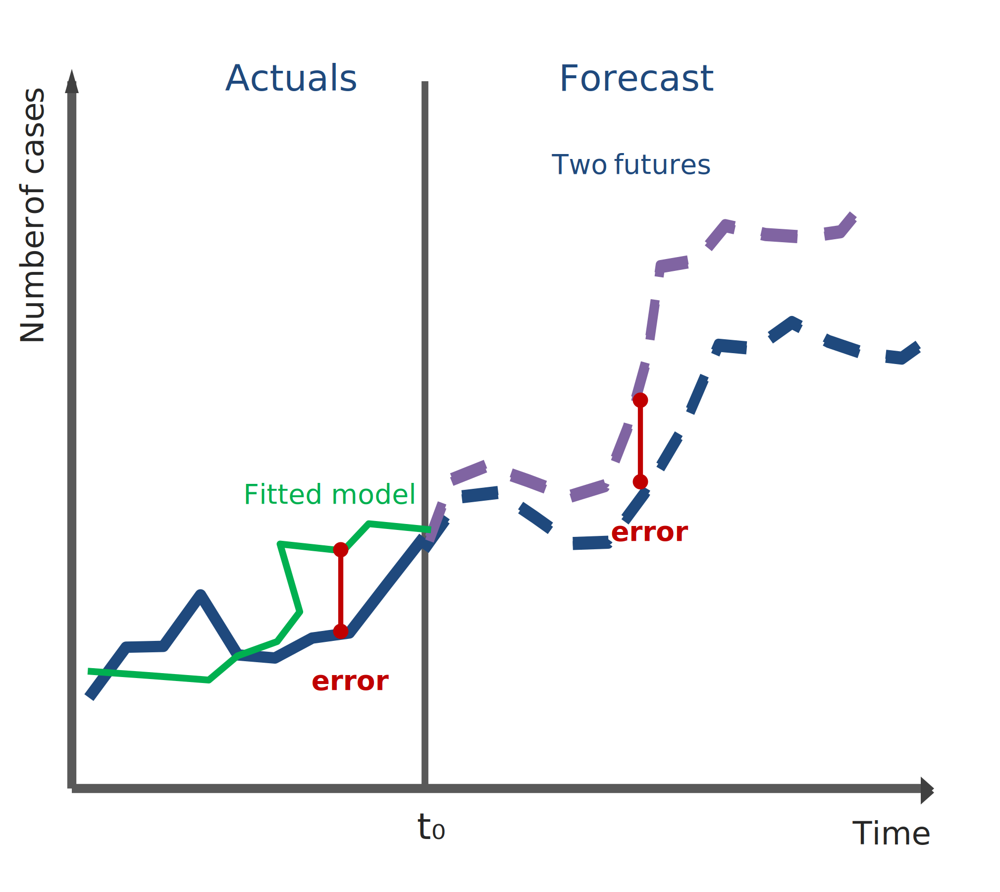

**Step 1:** $y^*_{T+1} = \hat{y}_{T+1|T} + e^*_{T+1}$

:::

:::

::: {.column width="2%"}

:::

::: {.column width="32%"}

::: {.fragment}

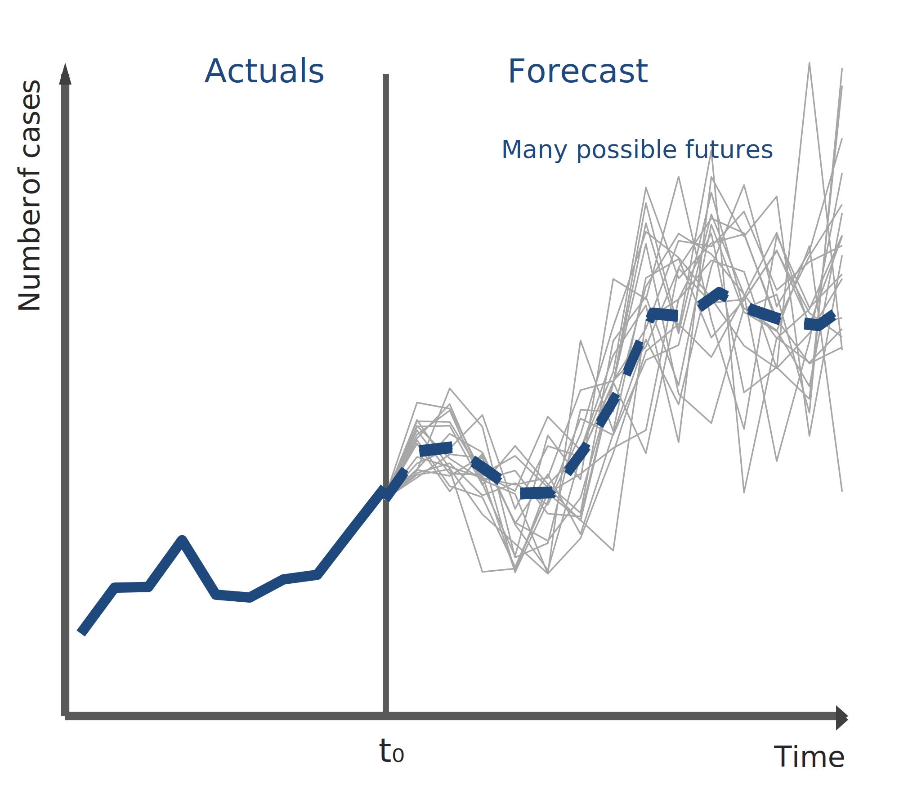

**Iterate:** Add $y^*_{T+1}$ to the history and repeat: $y^*_{T+2} = \hat{y}_{T+2|T+1} + e^*_{T+2}$

:::

:::

::::

## Bootstrap sampling using `fable` in `R`

Use `generate` argument to forecast multiple paths.

```{r}
#| echo: true
#| code-fold: true

fit_arimax |> 
  generate(new_data = brazil_dengue_tsb_future, bootstrap = TRUE, times = 5) |> 
  head(3)
```

Visualise sample future paths

```{r}
#| echo: true
#| code-fold: true
#| fig-width: 18
#| fig-height: 10
#| output-location: slide

sim <- fit_arimax |> 
  generate(new_data = brazil_dengue_tsb_future, bootstrap = TRUE, times = 5)

brazil_dengue_tsb |> 
  filter_index('2015 Jan' ~ .) |> 
  filter(location == 'Bahia') |>
  ggplot(aes(x = time_period)) +
  geom_line(aes(y = disease_cases), linewidth = 1.75) +
  geom_line(aes(y = .sim, colour = as.factor(.rep)), linewidth = 1.75,
    data = sim)+
  labs(y = "Disease Cases", x = "Month", colour="Future") +
  theme_minimal(base_family = "Inter", base_size = 40) +
  theme(panel.border = element_rect(color = "lightgrey", fill = NA))

```

## Forecast intervals from bootstrapped residuals

Forecast intervals can be extracted using the `hilo()` function


```{r}
#| echo: true
#| code-fold: true

fit_arimax |> 
  forecast(new_data = brazil_dengue_tsb_future, bootstrap = TRUE, times = 100) |> 
  hilo() |> 
  head(3)
```

Visualize the prediction intervals

```{r}
#| echo: true
#| code-fold: true
#| fig-width: 18
#| fig-height: 10
#| output-location: slide


fit_arimax |> 
  forecast(new_data = brazil_dengue_tsb_future, bootstrap = TRUE, times = 100) |> 
  autoplot(brazil_dengue_tsb |> 
             filter(location == 'Bahia') |>
             filter_index('2015 Jan' ~ .)) +
  theme_minimal(base_family = "Inter", base_size = 40) +
  theme(panel.border = element_rect(color = "lightgrey", fill = NA))

```

## {.center background-color="#242B4A"}

[Now it is your turn.]{.bigger}

```{r}
#| echo: false

countdown::countdown(minutes = 10, seconds = 00)
```

## Key assumptions

1.  **Representativeness:** The past residuals are a good sample of what could happen in the future.
2.  **Independence (Standard):** Residuals are uncorrelated (IID).
3.  **Independence (Block):** If residuals are dependent (autocorrelated), we must sample "blocks" of errors rather than single points to preserve the structure.
4. **Best for:** "What-if" scenarios, cumulative risk, and explosive outbreaks.

::: {.table-custom}

| Pros | Cons | When to Select |
| :--- | :--- | :--- |
| **Captures Asymmetry:** Does not force a Bell Curve. It naturally handles skewed risk (e.g., cases can spike to 5,000 but cannot go below zero). | **Computationally Expensive:** Slower than model-based methods; requires generating and storing 1,000+ sample paths per series. | **Explosive Outbreaks:** When the risk is one-sided (e.g., a potential exponential spike in Dengue cases). |
| **Path Dependency:** Simulates connected trajectories. This allows you to calculate cumulative risk (e.g., "Probability that cases exceed capacity for 3 weeks in a row"). | **The Autocorrelation Trap:** Standard bootstrapping destroys temporal patterns. If residuals are dependent (sticky), you must use "Block Bootstrap," which adds complexity. | **Cumulative Risk Analysis:** When stakeholders need to know the total case count over the next season, not just the peak. |
| **Robustness:** Works well when residuals have extreme outliers or "fat tails" that would break a normal distribution. | **Data Hungry:** Requires a long enough history of residuals to draw a representative sample. | **Low Count Data:** When a standard model is predicting negative numbers and you need a strict zero-bound. |

:::

## {.center background-color="#242B4A"}

[03]{.bigger} 

[Conformal predictions]{.big}


## Conformal prediction intervals

Unlike Model-Based methods (which assume a distribution) or Bootstrapping (which assumes history repeats), Conformal Prediction focuses on the model's past performance on unseen data. It asks: ["How wrong was this model on the calibration set?"]{.highlight-blue} and uses that to build a rigorous interval for the future.

:::: {.columns}

::: {.column width="32%"}

::: {.fragment}

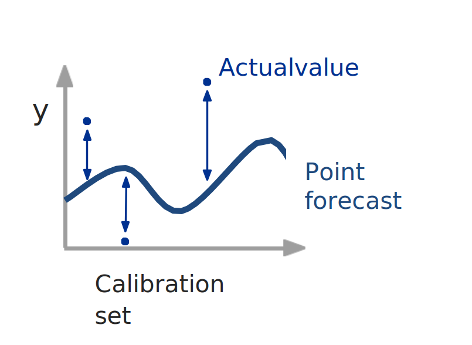

Train point forecast model on the training set and forecast on calibration set


:::

:::

::: {.column width="2%"}

:::

::: {.column width="32%"}

::: {.fragment}

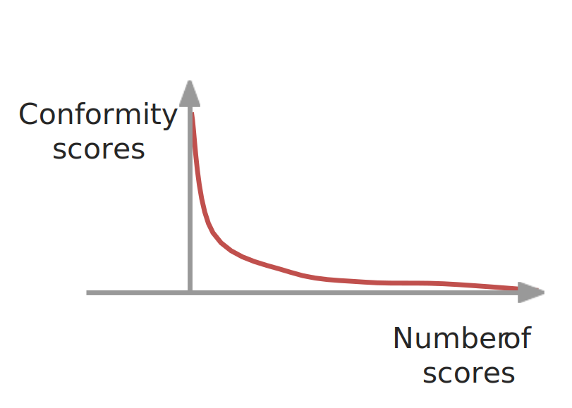

Get conformity scores and create a sorted list with absolute conformity scores

:::

:::

::: {.column width="2%"}

:::

::: {.column width="32%"}

::: {.fragment}

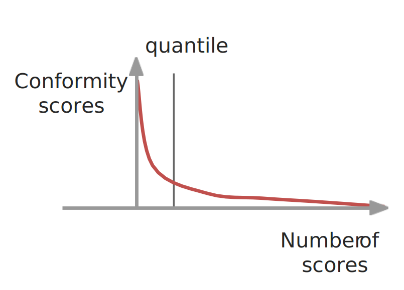

Select the quantile of the prediction interval

:::

:::

::::


## Conformal prediction intervals

Unlike Model-Based methods (which assume a distribution) or Bootstrapping (which assumes history repeats), Conformal Prediction focuses on the model's past performance on unseen data. It asks: ["How wrong was this model on the calibration set?"]{.highlight-blue} and uses that to build a rigorous interval for the future.

:::: {.columns}

::: {.column width="32%"}

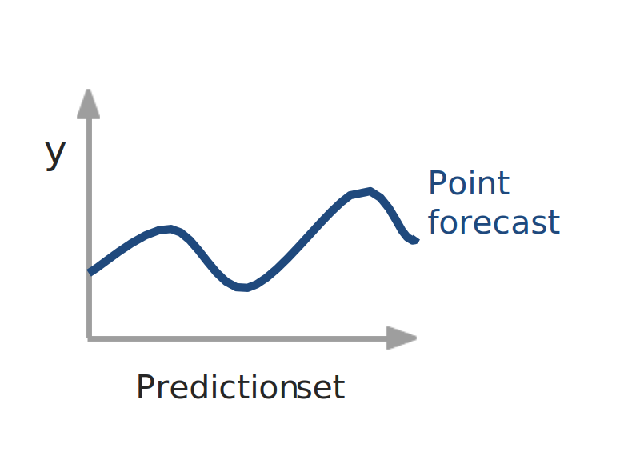

Forecast with a point forecast model

:::

::: {.column width="2%"}

:::

::: {.column width="64%"}

::: {.fragment}

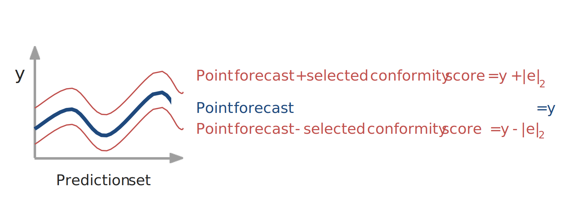

Add prediction interval based on conformity scores

:::

:::

::::


## Conformal prediciton using `ConformalForecast` in `R`

Pick one series and prepare data

```{r}
#| echo: true
#| code-fold: true

bahia <- brazil_dengue_tsb |>
  filter(location == "Bahia") |>
  arrange(time_period) |>
  as_tibble()

y_all <- ts(bahia$disease_cases, frequency = 12)

xreg_all <- bahia |>
  select(rainfall, mean_temperature) |>
  as.matrix()

# Define split dates
train_end  <- yearmonth("2014 Dec")
calib_start <- yearmonth("2015 Jan")
calib_end   <- yearmonth("2015 Dec")
test_start  <- yearmonth("2016 Jan")
test_end    <- yearmonth("2016 Dec")

idx <- bahia$time_period

i_train_end  <- max(which(idx <= train_end))
i_calib_end  <- max(which(idx <= calib_end))
i_test_start <- min(which(idx >= test_start))
i_test_end   <- max(which(idx <= test_end))

# train length used as rolling window size in cvforecast
window_len <- i_train_end

# series up to end of calibration (train + calibration)
y_train_calib <- ts(bahia$disease_cases[1:i_calib_end], frequency = 12)
xreg_train_calib <- xreg_all[1:i_calib_end, , drop = FALSE]

```


Create forecast function for cvforecast (ARIMAX via forecast::Arima)

```{r}
#| echo: true
#| code-fold: true

farimax_1step <- function(x, h, level) {
  t <- length(x)

  xreg_train  <- xreg_train_calib[1:t, , drop = FALSE]
  xreg_future <- xreg_train_calib[(t + 1):(t + h), , drop = FALSE]

  fit <- forecast::Arima(x, xreg = xreg_train)
  forecast::forecast(fit, h = h, level = level, xreg = xreg_future)
}
```


"Calibration" residuals via cvforecast across the 12 calibration months

```{r}
#| echo: true
#| code-fold: true

# This produces 1-step-ahead errors for each month in the calibration year.
fc_cal <- cvforecast(
  y = y_train_calib,
  forecastfun = farimax_1step,
  h = 1,
  level = 95,
  forward = FALSE,
  window = window_len,
  initial = 1
)

# absolute errors (conformity scores)
scores <- abs(as.numeric(fc_cal$ERROR))
q_95 <- quantile(scores, 0.95, na.rm = TRUE)
```

## Conformal prediciton using `ConformalForecast` in `R`

Forecast the 12-month test period (fit on train+calib, forecast test)

```{r}
#| echo: true
#| code-fold: true

# Fit on all available up to calibration end:
fit_final <- forecast::Arima(
  ts(bahia$disease_cases[1:i_calib_end], frequency = 12),
  xreg = xreg_all[1:i_calib_end, , drop = FALSE]
)

fc_test <- forecast::forecast(
  fit_final,
  h = (i_test_end - i_test_start + 1),
  xreg = xreg_all[i_test_start:i_test_end, , drop = FALSE]
)

test_dates <- bahia$time_period[i_test_start:i_test_end]
yhat <- as.numeric(fc_test$mean)

```

Visualise the conformal prediction intervals


```{r}
#| echo: true
#| code-fold: true
#| fig-width: 20
#| fig-height: 10
#| output-location: slide


plot_fc <- tibble(
  time_period = test_dates,
  point = yhat,
  lower_95 = pmax(0, yhat - q_95),
  upper_95 = yhat + q_95,
  actual = bahia$disease_cases[i_test_start:i_test_end]
)

history <- bahia |>
  filter(time_period >= yearmonth("2014 Jan") & time_period <= calib_end)

ggplot() +
  geom_line(
    data = history,
    aes(x = time_period, y = disease_cases, colour = "Actual"),
    linewidth = 1.75
  ) +
  geom_ribbon(
    data = plot_fc,
    aes(x = time_period, ymin = lower_95, ymax = upper_95, fill = "95% Conformal PI"),
    alpha = 0.2
  ) +
  geom_line(
    data = plot_fc,
    aes(x = time_period, y = point, colour = "Point Forecast"),
    linewidth = 1.75
  ) +
  geom_line(
    data = plot_fc,
    aes(x = time_period, y = actual, colour = "Actual"),
    linewidth = 1.75
  ) +
  scale_colour_manual(
    name = NULL,
    values = c(
      "Point Forecast" = "#0072B2",
      "Actual" = "black"
    )
  ) +
  scale_fill_manual(
    name = NULL,
    values = c("95% Conformal PI" = "#0072B2")
  ) +
  guides(
    colour = guide_legend(order = 1, override.aes = list(linewidth = 1.6)),
    fill   = guide_legend(order = 2)
  ) +
  labs(x = "Month", y = "Disease Cases") +
  theme_minimal(base_family = "Inter", base_size = 36) +
  theme(
    panel.border = element_rect(color = "lightgrey", fill = NA),
    legend.position = "right"
  )


```

## {.center background-color="#242B4A"}

[Now it is your turn.]{.bigger}

```{r}
#| echo: false

countdown::countdown(minutes = 10, seconds = 00)
```

## Key Assumptions

1.  **Exchangeability:** The calibration data (recent past) looks statistically similar to the test data (near future).
2.  **Symmetry:** Standard "Split Conformal" produces symmetric intervals (constant width), though advanced versions (CQR) can handle asymmetry.
3. **Best for:** Complex "Black Box" models (AI/ML) and strict policy requirements.

::: {.table-custom}

| Pros | Cons | When to Select |
| :--- | :--- | :--- |
| **Model Agnostic:** Works with *any* model (Neural Networks, Random Forest, XGBoost). You do not need to understand the math inside the "black box". | **Data Hungry (Splitting):** Requires a separate "Calibration Set" withheld from training. In short time series, sacrificing 20% of data for calibration is painful. | **Using Machine Learning:** When you are using complex non-linear models where calculating a standard deviation ($\sigma$) is impossible. |
| **Finite-Sample Guarantee:** Mathematically guaranteed to cover the true value $(1-\alpha)\%$ of the time, regardless of the underlying distribution. | **The Drift Problem:** Relies on "Exchangeability." If the climate shifts effectively (Distribution Drift), the calibration data no longer represents the future, and coverage fails. | **Regulatory/Policy Compliance:** When you must prove to stakeholders that your intervals are statistically valid (e.g., "guaranteed 90% coverage"). |
| **Distribution Free:** Does not assume errors are Normal, Poisson, or Skewed. It constructs intervals based purely on empirical past performance. | **Constant Widths:** Basic Split Conformal produces a fixed-width "tube" that doesn't adapt to local volatility (unless using advanced Adaptive Conformal). | **Complex Distributions:** When data is messy, multi-modal, or refuses to fit any standard statistical distribution. |

:::

## Resources

<br>

- [Forecasting: Principles and Practice by Rob J Hyndman and George Athanasopoulos](https://otexts.com/fpp3/)

- [Introduction to conformalForecast](https://xqnwang.github.io/conformalForecast/articles/conformalForecast.html#conformal-prediction)

- [Bootstrapping time series for improving forecasting accuracy](https://petolau.github.io/Bootstrapping-time-series-for-improving-forecasting-in-R/)

- [Conformal PID Control for Time Series Prediction](https://arxiv.org/abs/2307.16895)


## Any questions or thoughts? 💬 

{fig-align="center"}


