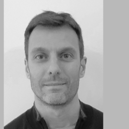
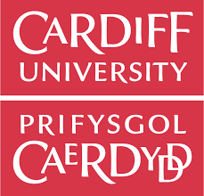

::: {.phd-page}

::: {.phd-hero}
::: {.phd-hero-inner}

PhD Research Project

<h1>Forecasting for Health Supply Chains</h1>

Improving demand forecasting for family planning so that contraceptives are available when and where they are needed.

::: {.phd-topics}
Forecasting
Uncertainty
Inventory
Public health
:::
:::
:::

::: {.phd-section}
::: {.phd-section-inner}

The Core Challenge

## What Was Lost?

In public health, zero recorded demand does not necessarily mean zero need. It can mean that the shelves were empty. When a health facility runs out of stock, the community's true demand goes unrecorded. This censored or lost demand leads to flawed forecasts, chronic under-stocking, and a cycle of supply failure. My research focuses on breaking this cycle.
:::
:::

::: {.phd-section}
::: {.phd-section-inner}

Research Outputs

## Publications and Code

::: {.phd-output-list}
::: {.phd-output}
::: {.phd-output-copy}
### A Novel Hybrid Approach to Contraceptive Demand Forecasting

International Journal of Production Research

:::

::: {.phd-output-actions}
[Read paper](https://doi-org.cardiff.idm.oclc.org/10.1080/00207543.2025.2526169){.phd-button}
[View code](https://github.com/chamara7h/hybrid_forecasting_framework){.phd-button .phd-button-secondary}
:::
:::

::: {.phd-output}
::: {.phd-output-copy}
### Estimating Censored Demand in Family Planning Supply Chains

Forecast accuracy, inventory implications, and public-health outcomes · Preprint under review

:::

::: {.phd-output-actions}
[Paper forthcoming](#){.phd-button}
[Code forthcoming](#){.phd-button .phd-button-secondary}
:::
:::
:::
:::
:::

::: {.phd-impact}
::: {.phd-section-inner}

Research in Practice

## EPSS Forecasting Training

Research is most valuable when it is put into practice. As part of this project, I developed and delivered a two-day workshop for practitioners at the Ethiopian Pharmaceutical Supply Service, supporting modern forecasting with R and Python.

::: {.phd-impact-actions}
[Training materials](../lab/epss_training/){.phd-button .phd-button-light}
[Code and labs](https://github.com/chamara7h/epss_training){.phd-button .phd-button-outline-light}
:::
:::
:::

::: {.phd-section}
::: {.phd-section-inner}

Project Team

## Supervision and Collaboration

::: {.phd-team}
::: {.phd-person}
{alt="Prof. Bahman Rostami-Tabar"}

### Prof. Bahman Rostami-Tabar

Lead Supervisor · Cardiff University
:::

::: {.phd-person}
{alt="Prof. Aris Syntetos"}

### Prof. Aris Syntetos

Co-supervisor · Cardiff University
:::

::: {.phd-person}
{alt="Dr. Federico Liberatore"}

### Dr. Federico Liberatore

Co-supervisor · Cardiff University
:::

::: {.phd-person}
{alt="Glenn Milano"}

### Glenn Milano

Industry Collaborator · USAID
:::
:::
:::
:::

::: {.phd-section .phd-partners-section}
::: {.phd-section-inner}

Support

## Funding and Partners

::: {.phd-partners}
{alt="Cardiff University"}
{alt="Data Lab for Social Good"}
{alt="Wales Graduate School for the Social Sciences"}
{alt="USAID"}
:::
:::
:::

:::
