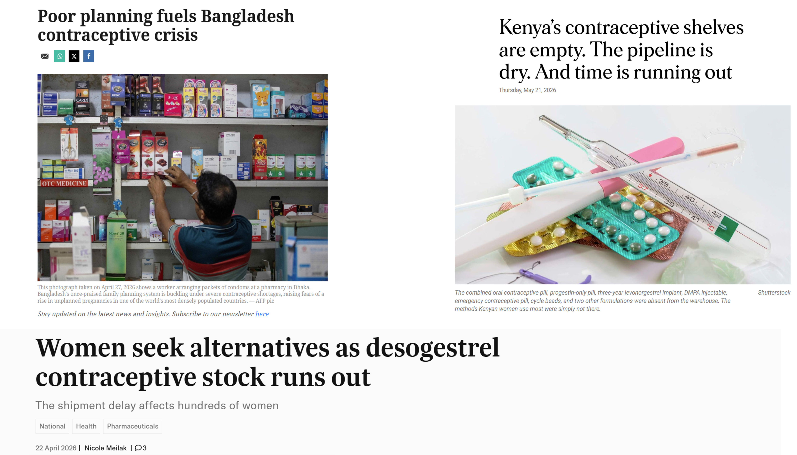
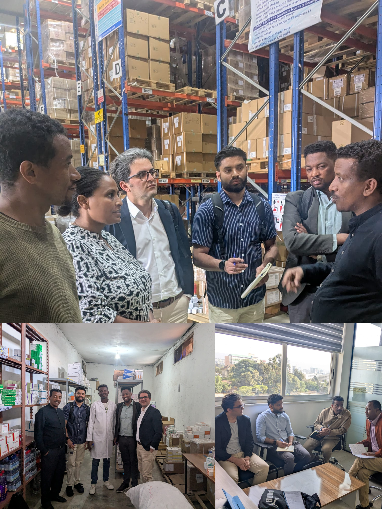
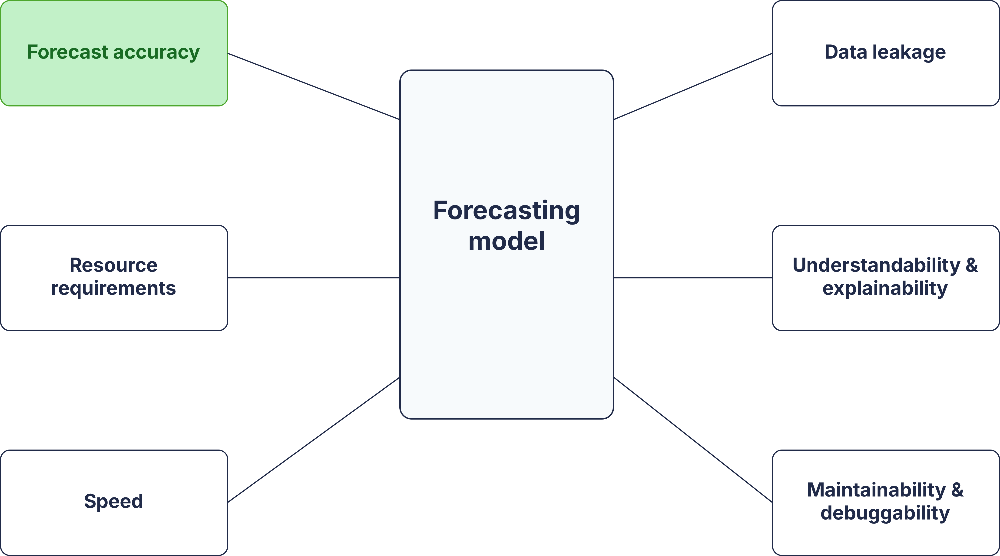
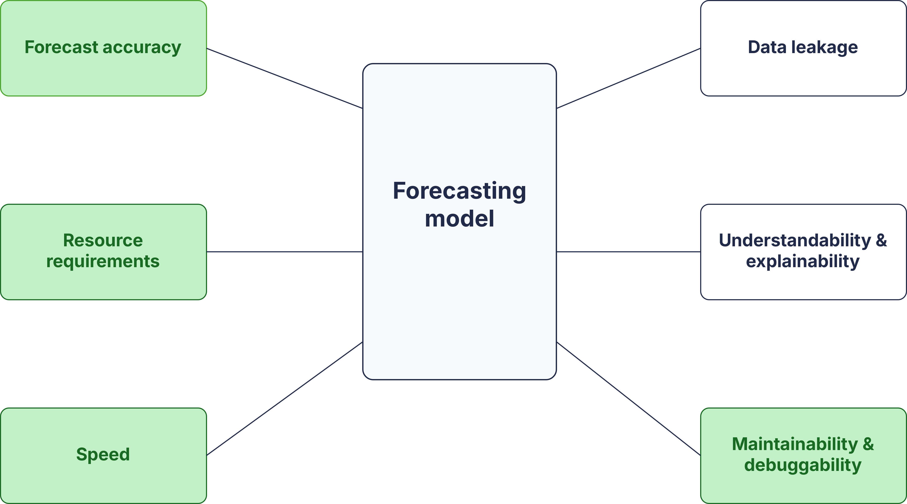
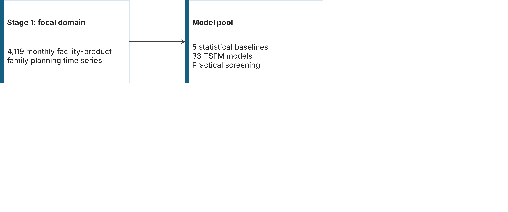
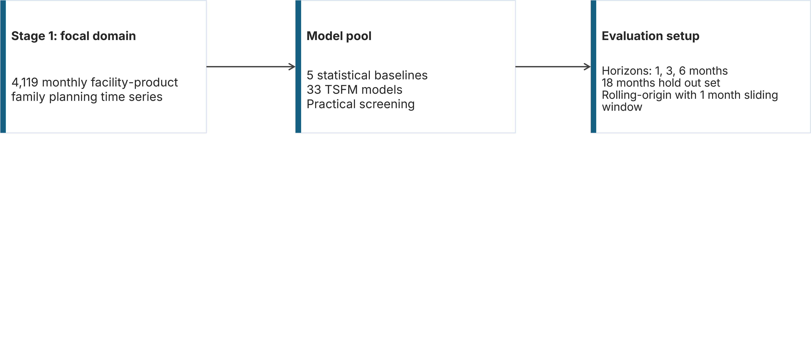
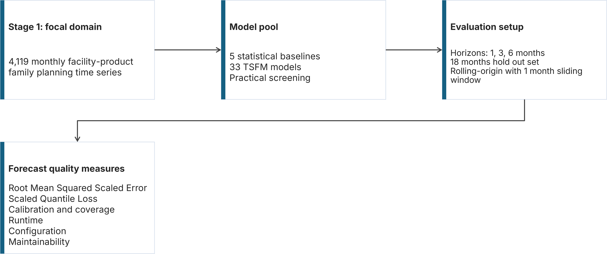
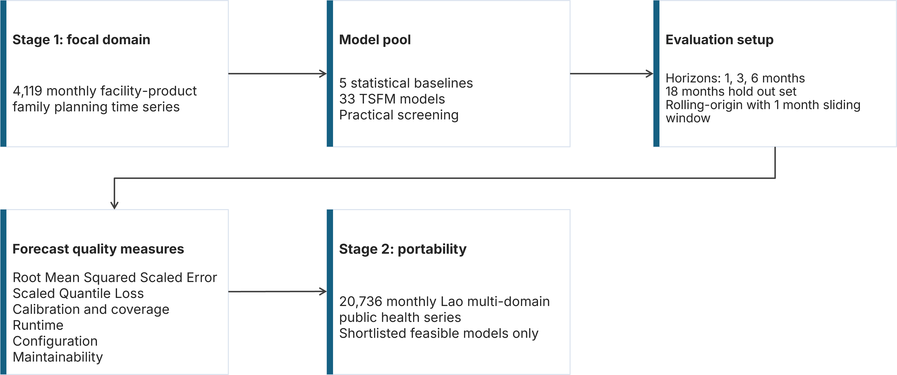
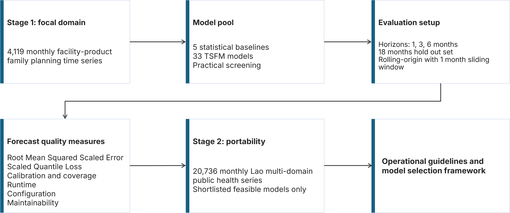
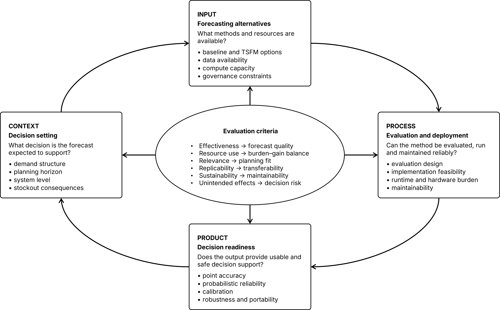

---
format: 
  revealjs:
    slide-number: c/t
    width: 1920
    height: 1080
    logo: "images/logo.png"
    footer: "[Evaluating and Benchmarking Time Series Foundational Models for Public Healthcare Demand Forecasting](https://chamara7h.github.io/talks/)"
    css: theme.css
    echo: true
execute:
  warning: false
  echo: false
header-includes:
  - '<link rel="stylesheet" href="https://cdnjs.cloudflare.com/ajax/libs/font-awesome/6.4.0/css/all.min.css">'
---   

```{r}
#| label: setup-isf-local-data
#| include: false

isf_data_path <- function(filename) {
  project_path <- file.path("presentations", "isf_2026", "data", filename)
  local_path <- file.path("data", filename)

  if (file.exists(project_path)) project_path else local_path
}
```

# {.title-slide background-image="images/cover.png" background-size="cover"}

<div class="logo-container">
  
  
  
  
</div>

<div class="title-slide">
  <h1>Evaluating and Benchmarking Time Series Foundational Models</h1>
  <h2>for Public Healthcare Demand Forecasting</h2>
  <p class="author">by Harsha Halgamuwe Hewage, PhD student</p>
  <p class="author">Lead supervisor: Prof. Bahman Rostami-Tabar</p>
  <p class="author">Co supervisors: Prof. Aris Syntetos & Dr. Federico Liberatore</p>

  <p class="date">2026/06/30</p>
</div>


::: aside
**Image credits**: AI-generated visuals created with OpenAI. No real patient or facility images are used.
:::

## {}

{width="87.5%"}

::: aside
**Sources**: MalayMail; NationAfrica; TimesofMalta
:::

## {} 

:::: {.columns}

::: {.column width="40%"}
{.absolute top="-10%" left="-10%" height="120%" style="max-height: unset;"}
:::

::: {.column width="2.5%"}

:::

::: {.column width="57.5%"}

<br>

<br>

[Outline]{.highlight-title}

::: {.step data-step="01"}
<div class="step-content">
  <p>Motivation: why this problem matters</p>
</div>
:::

::: {.step data-step="02"}
<div class="step-content">
  <p>The planning reality</p>
</div>
:::

::: {.step data-step="03"}
<div class="step-content">
  <p>Why TSFMs look attractive</p>
</div>
:::

::: {.step data-step="04"}
<div class="step-content">
  <p>Forecast quality beyond accuracy</p>
</div>
:::


::: {.step data-step="05"}
<div class="step-content">
  <p>Experimental design and results</p>
</div>
:::

::: {.step data-step="05"}
<div class="step-content">
  <p>Where this work goes next</p>
</div>
:::

:::

::::

## {background-color="#212B49"}

<br>
<br>
<br>
<br>

[121 million]{.bigger style="color: #FFC000;"} unintended pregnancies occur each year worldwide.

<br>

::: {.fragment}
Over [60%]{.bigger style="color: #FFC000;"} of unintended pregnancies end in abortion,
:::

<br>

::: {.fragment}
and over [45%]{.bigger style="color: #FFC000;"} of abortions are unsafe.
:::

::: aside
**Sources**: United Nations Department of Economic and Social Affairs 2020; Sully et al. 2020; Bearak et al. 2020.
:::


## {}

:::: {.columns}

::: {.column width="40%"}
{.absolute top="-10%" left="-10%" height="120%" style="max-height: unset;"}
:::

::: {.column width="2.5%"}
:::

::: {.column width="57.5%"}
<div class="planning-quotes">

[What the planning reality looks like ]{.highlight-title}

::: {.fragment}
> “Forecasting tools exist, but the last-mile planning reality is still Excel, paper forms, manual adjustments, and fragmented systems.”

[Ethiopia field visit and collaborator feedback]{.note-source}
:::

::: {.fragment}
> “A tool can be ‘in use’, but only in a limited scope, during a project period, or in central sites, without scaling to the whole country.”

[DHIS2/HISP collaborator feedback]{.note-source}
:::

</div>
:::

::::

## {}

:::: {.columns}

::: {.column width="40%"}
{.absolute top="-10%" left="-10%" height="120%" style="max-height: unset;"}
:::

::: {.column width="2.5%"}
:::

::: {.column width="57.5%"}

[Why time series foundation models look attractive]{.highlight-title}

<br>

- Public health systems have many related but weak individual time series.

::: {.fragment}
- TSFMs may transfer learned temporal patterns from large-scale pretraining.
:::

::: {.fragment}
- They can reduce the need for long local histories, manual feature engineering, and repeated local model building.
:::

::: {.fragment}
- This creates the potential to democratise forecasting support for facilities where planning is often done by nurses, store managers, or non-specialist staff.
:::

:::

::::

## But accuracy is (not) all we need

<center>
  
</center>


::: aside
**Sources:** Accuracy is (not) all we need presentation by Stephan Kolassa (2025)
:::

## But accuracy is (not) all we need

<center>
  
</center>


::: aside
**Sources:** Accuracy is (not) all we need presentation by Stephan Kolassa (2025)
:::

## {background-color="#212B49" .center}

[Do time series foundation models provide better [forecast quality]{style="color: #FFC000;"} than statistical baselines in public health supply chains?]{.bigger}

## Data used in this study {.data-overview-slide}

```{=html}
<div class="data-overview-wrap">
  <table class="data-overview-table">
    <colgroup>
    <col style="width: 13%;">
    <col style="width: 27%;">
    <col style="width: 16%;">
    <col style="width: 18%;">
    <col style="width: 18%;">
    <col style="width: 8%;">
  </colgroup>
    <thead>
      <tr>
        <th>Country</th>
        <th>Domains</th>
        <th>Period</th>
        <th>Geographic granularity</th>
        <th>Product granularity</th>
        <th>Series</th>
      </tr>
    </thead>
    <tbody>
      <tr>
        <td><strong>Côte d’Ivoire</strong></td>
        <td>Family planning</td>
        <td>Apr 2016 to Sep 2019</td>
        <td>Facility / site</td>
        <td>Contraceptive product</td>
        <td class="series-cell">1,360</td>
      </tr>
      <tr>
        <td><strong>Lao PDR</strong></td>
        <td>Family planning</td>
        <td>Jan 2019 to Dec 2023</td>
        <td>Service delivery unit / org unit</td>
        <td>Contraceptive product</td>
        <td class="series-cell">1,446</td>
      </tr>
      <tr>
        <td><strong>Pakistan</strong></td>
        <td>Family planning</td>
        <td>Jan 2019 to Jun 2025</td>
        <td>Service delivery unit / org unit</td>
        <td>Contraceptive product</td>
        <td class="series-cell">1,313</td>
      </tr>
      <tr>
        <td><strong>Lao PDR</strong></td>
        <td>General/ acute care <br> Maternal & newborn health <br> Malaria <br> Immunisation/ EPI <br> Non-communicable diseases</td>
        <td>Jan 2019 to Dec 2023</td>
        <td>Service delivery unit / org unit</td>
        <td>Health commodity product</td>
        <td class="series-cell">20,736</td>
      </tr>
    </tbody>
  </table>
</div>
```

## Experimental design

<br>

<center>
  
</center>

## Experimental design

<br>

<center>
  
</center>

## Experimental design

<br>

<center>
  
</center>

## Experimental design

<br>

<center>
  
</center>

## Experimental design

<br>

<center>
  
</center>

## Experimental design

<br>

<center>
  
</center>

## {background-color="#212B49" .center}

Note: Experiments were run locally on an [Intel Core Ultra 9 185H processor with 32 GB RAM between Jan–Mar 2026]{style="color: #FFC000;"}. Runtime bottlenecks and execution failures should be interpreted in this testing context.

**Results shown:** [family planning data, 3-month forecast horizon.]{style="color: #FFC000;"}

## A quick look at the data

```{r}
#| echo: false
#| label: fig-wp3_ts_features
#| fig-width: 14
#| fig-height: 7
#| fig-cap: "Time series characteristics across the family planning dataset. Panel (a) illustrates trend versus seasonal strength, while Panel (b) displays demand variability against intermittency. The color scale encodes spectral entropy, where lighter colors indicate more predictable, structured dynamics."

library(tidyverse)
library(patchwork)
library(viridis)

wd <- normalizePath(getwd(), winslash = "/", mustWork = FALSE)

feat_all_fp <- read_rds(isf_data_path("feat_all_fp.rds"))

p1 <- feat_all_fp |>
  filter(country != 'Ethiopia') |> 
  ggplot(aes(x = trend_strength, y = seasonal_strength_year, colour = spectral_entropy)) +
  geom_point(size = 1.75, stroke = 1, alpha = 0.8) +
  labs(
    x = "Trend strength",
    y = "Seasonal strength",
    colour = "Spectral entropy",
    title = 'Panel (a)'
  ) +
  scale_colour_viridis_c(begin = 0.15, end = 0.85, direction = -1) +
  theme_minimal(base_family = "sans", base_size = 14) +
  theme(
    panel.border       = element_rect(colour = "#6d8196", fill = NA, size = 0.4),
    panel.grid.major   = element_line(colour = "grey92", size = 0.35),
    panel.grid.minor   = element_blank(),
    axis.title         = element_text(face = "bold", colour = "#1a2b48"),
    axis.text          = element_text(colour = "#1a2b48"),
    legend.position    = "right",
    legend.title       = element_text(face = "bold", colour = "#1a2b48"),
    legend.text        = element_text(colour = "#1a2b48"),
    plot.title = element_text(colour = "#1a2b48", size = 14)
  )

p2 <- feat_all_fp |>
  filter(country != 'Ethiopia') |> 
  mutate(
    ln_IDI = log(IDI),
    ln_CV2 = log(CV2),
    ln_CV2 = na_if(log(CV2), -Inf)
  ) |>
  ggplot(aes(x = ln_CV2, y = ln_IDI, colour = spectral_entropy)) +
  geom_point(size = 1.75, stroke = 1, alpha = 0.8) +
  labs(
    x = "ln(CV²)",
    y = "ln(IDI)",
    colour = "Spectral entropy",
    title = 'Panel (b)'
  ) +
  scale_colour_viridis_c(begin = 0.15, end = 0.85, direction = -1) +
  theme_minimal(base_family = "sans", base_size = 14) +
  theme(
    panel.border       = element_rect(colour = "#6d8196", fill = NA, size = 0.4),
    panel.grid.major   = element_line(colour = "grey92", size = 0.35),
    panel.grid.minor   = element_blank(),
    axis.title         = element_text(face = "bold", colour = "#1a2b48"),
    axis.text          = element_text(colour = "#1a2b48"),
    legend.position    = "right",
    legend.title       = element_text(face = "bold", colour = "#1a2b48"),
    legend.text        = element_text(colour = "#1a2b48"),
    plot.title = element_text(colour = "#1a2b48", size = 14))

(p1 | p2) +
  plot_layout(guides = "collect") +
  plot_annotation(theme = theme(legend.position = "right"))

```

## TSFMs can improve point accuracy

```{r}
#| echo: false
#| label: fig-isf-nemenyi-rmsse-h3
#| fig-width: 12
#| fig-height: 8.5
#| fig-cap: 'Multiple Comparisons with the Best (MCB) test results for RMSSE.'

library(tidyverse)
library(tsutils)

wd <- normalizePath(getwd(), winslash = "/", mustWork = FALSE)

rmsse_fp_tidy_h3 <- read_rds(isf_data_path("rmsse_h3_by_series.rds")) |>
  select(unique_id, model, mean_rmsse) |>
  pivot_wider(names_from = model, values_from = mean_rmsse) |>
  select(-unique_id)

par(mar = c(3, 2, 3, 1))
p1 <- nemenyi(
  rmsse_fp_tidy_h3,
  conf.level = 0.95,
  plottype = "vmcb",
  main = ""
)

```

## Probabilistic performance tells a similar story

```{r}
#| echo: false
#| label: fig-isf-nemenyi-spin-h3
#| fig-width: 12
#| fig-height: 8.5
#| fig-cap: 'Multiple Comparisons with the Best (MCB) test results for sPIN.'


wd <- normalizePath(getwd(), winslash = "/", mustWork = FALSE)
spin_fp_tidy_h3 <- read_rds(isf_data_path("spin_h3_by_series.rds")) |>
  select(unique_id, model, mean_spin) |>
  pivot_wider(names_from = model, values_from = mean_spin) |>
  select(-unique_id)
par(mar = c(3, 2, 3, 1))

p1 <- nemenyi(
  spin_fp_tidy_h3,
  conf.level = 0.95,
  plottype = "vmcb",
  main = ""
)
```

## Aggregate loss can hide miscalibration

```{r}
#| echo: false
#| label: setup-isf-quantile-loss-coverage-h3
#| include: false

library(patchwork)

wd <- normalizePath(getwd(), winslash = "/", mustWork = FALSE)

quantile_loss_sum_fp <- read_rds(isf_data_path("quantile_loss_sum_fp.rds"))

coverage_summary_fp <- read_rds(isf_data_path("coverage_summary_fp.rds")) |>
  filter(model != "Chronos-2-synthetic")

distinct_colors <- c(
  "Chronos-2-FT" = "#2c3e50",
  "Naive" = "#c04657",
  "CrostonSBA" = "#007BA7",
  "Moirai-2.0-R-small" = "#CC79A7",
  "TimesFM-2.5-200m" = "#e67e22",
  "Chronos-2-FT-Full" = "#568203",
  "TiRex" = "#E6AB02"
)

top_models <- c(
  "Moirai-2.0-R-small",
  "TimesFM-2.5-200m",
  "Chronos-2-FT-Full",
  "TiRex"
)

bottom_models <- c(
  "Chronos-2-FT",
  "Naive",
  "CrostonSBA"
)

quantile_loss_base_data <- quantile_loss_sum_fp |>
  filter(forecast_horizon == 3)

coverage_base_data <- coverage_summary_fp |>
  filter(forecast_horizon == 3) |>
  group_by(model, forecast_horizon) |>
  summarise(
    cov_q10 = mean(cov_q10, na.rm = TRUE),
    cov_q20 = mean(cov_q20, na.rm = TRUE),
    cov_q30 = mean(cov_q30, na.rm = TRUE),
    cov_q40 = mean(cov_q40, na.rm = TRUE),
    cov_q50 = mean(cov_q50, na.rm = TRUE),
    cov_q60 = mean(cov_q60, na.rm = TRUE),
    cov_q70 = mean(cov_q70, na.rm = TRUE),
    cov_q80 = mean(cov_q80, na.rm = TRUE),
    cov_q90 = mean(cov_q90, na.rm = TRUE),
    .groups = "drop"
  ) |>
  pivot_longer(
    cols = starts_with("cov_q"),
    names_to = "quantile",
    values_to = "coverage"
  ) |>
  mutate(
    alpha = case_when(
      quantile == "cov_q10" ~ 0.1,
      quantile == "cov_q20" ~ 0.2,
      quantile == "cov_q30" ~ 0.3,
      quantile == "cov_q40" ~ 0.4,
      quantile == "cov_q50" ~ 0.5,
      quantile == "cov_q60" ~ 0.6,
      quantile == "cov_q70" ~ 0.7,
      quantile == "cov_q80" ~ 0.8,
      quantile == "cov_q90" ~ 0.9,
      TRUE ~ NA_real_
    )
  )

all_models <- union(unique(quantile_loss_base_data$model), unique(coverage_base_data$model))
other_models <- setdiff(all_models, names(distinct_colors))

model_shapes <- c(
  "Chronos-2-FT" = 3,
  "Naive" = 12,
  "CrostonSBA" = 14,
  "Moirai-2.0-R-small" = 11,
  "TimesFM-2.5-200m" = 9,
  "Chronos-2-FT-Full" = 4,
  "TiRex" = 6
)

model_shapes <- c(model_shapes, setNames(rep(16, length(other_models)), other_models))

model_colors <- setNames(rep("#d3d3d3", length(all_models)), all_models)
model_colors[names(distinct_colors)] <- distinct_colors

plot_theme <- theme_minimal(base_family = "sans", base_size = 14) +
  theme(
    panel.border = element_rect(colour = "#6d8196", fill = NA, linewidth = 0.4),
    panel.grid.major = element_line(colour = "grey92", linewidth = 0.35),
    panel.grid.minor = element_blank(),
    axis.title = element_text(face = "bold", colour = "#1a2b48"),
    axis.text = element_text(colour = "#1a2b48"),
    plot.title = element_text(face = "bold", colour = "#1a2b48", size = 14),
    legend.title = element_text(face = "bold", colour = "#1a2b48"),
    legend.text = element_text(colour = "#1a2b48")
  )

make_diagnostic_plots <- function(active_models, include_background = TRUE) {
  quantile_loss_plot_data <- quantile_loss_base_data |>
    filter(include_background | model %in% active_models) |>
    mutate(model_group = if_else(model %in% active_models, "highlight", "background"))

  coverage_plot_data <- coverage_base_data |>
    filter(include_background | model %in% active_models) |>
    mutate(model_group = if_else(model %in% active_models, "highlight", "background"))

  p_quantile_loss <- ggplot(
    quantile_loss_plot_data,
    aes(x = alpha, y = log(ql), colour = model, shape = model, group = model)
  ) +
    geom_line(
      data = \(d) d |> filter(model_group == "background"),
      linewidth = 0.3,
      alpha = 0.25,
      show.legend = FALSE
    ) +
    geom_point(
      data = \(d) d |> filter(model_group == "background"),
      size = 1.8,
      alpha = 0.25,
      show.legend = FALSE
    ) +
    geom_line(
      data = \(d) d |> filter(model_group == "highlight"),
      linewidth = 0.75,
      alpha = 0.95
    ) +
    geom_point(
      data = \(d) d |> filter(model_group == "highlight"),
      size = 2.4,
      alpha = 1
    ) +
    labs(
      x = "Quantile",
      y = "Mean scaled quantile loss (log scale)",
      colour = "Method",
      shape = "Method"
    ) +
    plot_theme +
    scale_color_manual(values = model_colors, breaks = active_models) +
    scale_shape_manual(values = model_shapes, breaks = active_models) +
    scale_x_continuous(
      breaks = sort(unique(quantile_loss_plot_data$alpha)),
      labels = paste0("q", sort(unique(quantile_loss_plot_data$alpha)) * 100)
    )

  p_coverage <- ggplot(
    coverage_plot_data,
    aes(x = alpha, y = coverage, colour = model, shape = model, group = model)
  ) +
    geom_abline(
      intercept = 0,
      slope = 1,
      linetype = "dotted",
      linewidth = 0.8,
      colour = "black"
    ) +
    geom_line(
      data = \(d) d |> filter(model_group == "background"),
      linewidth = 0.3,
      alpha = 0.25,
      show.legend = FALSE
    ) +
    geom_point(
      data = \(d) d |> filter(model_group == "background"),
      size = 1.8,
      alpha = 0.25,
      show.legend = FALSE
    ) +
    geom_line(
      data = \(d) d |> filter(model_group == "highlight"),
      linewidth = 0.75,
      alpha = 0.95
    ) +
    geom_point(
      data = \(d) d |> filter(model_group == "highlight"),
      size = 2.4,
      alpha = 1
    ) +
    labs(
      x = "Nominal quantile level",
      y = "Empirical coverage",
      colour = "Method",
      shape = "Method"
    ) +
    plot_theme +
    scale_color_manual(values = model_colors, breaks = active_models) +
    scale_shape_manual(values = model_shapes, breaks = active_models) +
    scale_x_continuous(
      breaks = sort(unique(coverage_plot_data$alpha)),
      labels = paste0("q", sort(unique(coverage_plot_data$alpha)) * 100),
      limits = c(0.1, 0.9)
    ) +
    scale_y_continuous(
      limits = c(0, 1),
      breaks = seq(0, 1, by = 0.2)
    )

  (p_quantile_loss | p_coverage) +
    plot_layout(guides = "collect")
}

```

```{r}
#| echo: false
#| label: fig-isf-quantile-loss-coverage-all-h3
#| fig-width: 14
#| fig-height: 7
#| fig-cap: 'Scaled quantile loss and empirical versus nominal coverage at forecast horizon 3 for the highlighted models.'

make_diagnostic_plots(names(distinct_colors), include_background = TRUE)

```

## Aggregate loss can hide miscalibration

```{r}
#| echo: false
#| label: fig-isf-quantile-loss-coverage-top-h3
#| fig-width: 14
#| fig-height: 7
#| fig-cap: 'Scaled quantile loss and empirical versus nominal coverage at forecast horizon 3 for the top-ranked models.'

make_diagnostic_plots(top_models, include_background = FALSE)

```

## Aggregate loss can hide miscalibration

```{r}
#| echo: false
#| label: fig-isf-quantile-loss-coverage-bottom-h3
#| fig-width: 14
#| fig-height: 7
#| fig-cap: 'Scaled quantile loss and empirical versus nominal coverage at forecast horizon 3 for the bottom-ranked models.'

make_diagnostic_plots(bottom_models, include_background = FALSE)

```

## Useful gains are available within minutes


```{r}
#| label: setup-isf-runtime-progressive
#| include: false

wd <- normalizePath(getwd(), winslash = "/", mustWork = FALSE)

overall_summary_fp <- read_rds(isf_data_path("overall_summary_fp.rds"))

runtime <- read_csv(isf_data_path("runtimes.csv")) |>
  filter(model != "Chronos-2-synthetic")

runtime_full <- runtime |>
  filter(domain != "Pharmaceutical", country != "Ethiopia") |>
  filter(is.finite(runtime), runtime > 0) |>
  group_by(model, forecast_horizon) |> 
  summarise(runtime = sum(runtime, na.rm = TRUE), .groups = "drop") |> 
  left_join(
    overall_summary_fp,
    by = c("model", "forecast_horizon")
  ) |> 
  left_join(
    runtime |> 
      distinct(model) |>
      arrange(model) |>
      mutate(model_id = row_number()),
    by = "model"
  ) |> 
  mutate(
    model_label = paste0(model_id, ". ", model)
  )

distinct_colors <- c(
  "AutoARIMA" = "#2c3e50",
  "Naive" = "#c04657",
  "Mean" = "#007BA7",
  "AutoETS" = "#CC79A7",
  "Moirai-2.0-R-small" = "#CC79A7",
  "TimesFM-2.5-200m" = "#e67e22",
  "Chronos-2-FT-Full" = "#568203",
  "TiRex" = "#E6AB02",
  "TimeGPT-1" = "#6A3D9A",
  "TimeGPT-1-FT" = "#6A3D9A"
)

highlight_models <- names(distinct_colors)

highlight_shapes <- c(
  "AutoARIMA" = 8,
  "Naive" = 12,
  "Mean" = 10,
  "AutoETS" = 2,
  "Moirai-2.0-R-small" = 11,
  "TimesFM-2.5-200m" = 9,
  "Chronos-2-FT-Full" = 4,
  "TiRex" = 6,
  "TimeGPT-1" = 5,
  "TimeGPT-1-FT" = 18
)

time_refs <- tibble(
  runtime = c(10, 60, 600, 3600, 86400),
  label   = c("10 sec", "1 min", "10 min", "1 hour", "1 day")
)

rmsse_final_fp <- read_rds(isf_data_path("rmsse_h3_by_series.rds")) |>
  rename(rmsse = mean_rmsse)

rmsse_rank_h3 <- rmsse_final_fp |>
  mutate(
    country = case_when(
      str_detect(unique_id, "Côte d'Ivoire") ~ "Côte d'Ivoire",
      str_detect(unique_id, "Ethiopia") ~ "Ethiopia",
      str_detect(unique_id, "Lao") ~ "Lao",
      str_detect(unique_id, "Pakistan") ~ "Pakistan",
      TRUE ~ NA_character_
    )
  ) |>
  filter(country != "Ethiopia", forecast_horizon == 3) |>
  group_by(unique_id, model, forecast_horizon) |>
  summarise(
    mean_rmsse = {
      x <- rmsse[is.finite(rmsse)]
      if (length(x) == 0) NA_real_ else mean(x)
    },
    .groups = "drop"
  ) |>
  filter(is.finite(mean_rmsse)) |>
  group_by(unique_id, forecast_horizon) |>
  mutate(rmsse_rank = rank(mean_rmsse, ties.method = "average")) |>
  ungroup() |>
  group_by(model, forecast_horizon) |>
  summarise(avg_rmsse_rank = mean(rmsse_rank, na.rm = TRUE), .groups = "drop")

plot_data_rank_wrap <- runtime_full |>
  filter(
    forecast_horizon == 3,
    is.finite(runtime),
    runtime > 0
  ) |>
  left_join(rmsse_rank_h3, by = c("model", "forecast_horizon")) |>
  filter(is.finite(avg_rmsse_rank)) |>
  mutate(
    forecast_horizon = factor(forecast_horizon, labels = "Forecast horizon = 3"),
    model_group = if_else(model %in% highlight_models, "highlight", "background")
  )

model_key_rank_wrap <- plot_data_rank_wrap |>
  distinct(model, model_id, model_label) |>
  arrange(model_id)

all_model_labels_rank_wrap <- setNames(
  model_key_rank_wrap$model_label,
  model_key_rank_wrap$model
)

colour_values_rank_wrap <- setNames(rep("black", nrow(model_key_rank_wrap)), model_key_rank_wrap$model)
colour_values_rank_wrap[names(distinct_colors)] <- distinct_colors

shape_values_rank_wrap <- setNames(rep(1, nrow(model_key_rank_wrap)), model_key_rank_wrap$model)
shape_values_rank_wrap[names(highlight_shapes)] <- highlight_shapes

ref_df_rank_wrap <- time_refs |>
  filter(
    runtime >= min(plot_data_rank_wrap$runtime, na.rm = TRUE),
    runtime <= min(86400, max(plot_data_rank_wrap$runtime, na.rm = TRUE) * 1.05)
  )

make_progressive_runtime_plot <- function(max_runtime = Inf) {
  progressive_data <- plot_data_rank_wrap |>
    mutate(
      reveal_group = if_else(runtime <= max_runtime, "highlight", "background")
    )

  active_models <- progressive_data |>
    filter(reveal_group == "highlight") |>
    pull(model)

  legend_models <- model_key_rank_wrap |>
    filter(model %in% active_models) |>
    pull(model)

  progressive_colours <- setNames(
    rep("#e5e7eb", nrow(model_key_rank_wrap)),
    model_key_rank_wrap$model
  )
  progressive_colours[active_models] <- "#212B49"

  active_special_models <- intersect(active_models, names(distinct_colors))
  progressive_colours[active_special_models] <- distinct_colors[active_special_models]

  progressive_shapes <- setNames(
    rep(1, nrow(model_key_rank_wrap)),
    model_key_rank_wrap$model
  )
  active_special_shapes <- intersect(active_models, names(highlight_shapes))
  progressive_shapes[active_special_shapes] <- highlight_shapes[active_special_shapes]

  ggplot(
    progressive_data,
    aes(x = runtime, y = avg_rmsse_rank)
  ) +
    geom_vline(
      data = ref_df_rank_wrap,
      aes(xintercept = runtime),
      colour = "#4C6EDB",
      linetype = "dashed",
      linewidth = 0.5,
      alpha = 0.8,
      inherit.aes = FALSE
    ) +
    geom_point(
      data = \(d) d |> filter(reveal_group == "background"),
      aes(colour = model, shape = model),
      size = 2.5,
      alpha = 0.45,
      stroke = 1,
      show.legend = FALSE
    ) +
    geom_point(
      data = \(d) d |> filter(reveal_group == "highlight"),
      aes(colour = model, shape = model),
      size = 4,
      alpha = 0.95,
      stroke = 1.25
    ) +
    ggrepel::geom_text_repel(
      data = \(d) d |> filter(reveal_group == "highlight"),
      aes(label = model_id),
      colour = "black",
      size = 4,
      family = "sans",
      min.segment.length = 0,
      box.padding = 0.35,
      point.padding = 0.25,
      max.overlaps = Inf,
      show.legend = FALSE
    ) +
    labs(
      x = "Runtime (seconds, log scale)",
      y = "Average RMSSE rank",
      colour = "Method",
      shape = "Method"
    ) +
    scale_x_log10(
      breaks = c(10, 60, 600, 3600, 86400),
      labels = c("10 sec", "1 min", "10 min", "1 hour", "1 day")
    ) +
    scale_colour_manual(
      values = progressive_colours,
      breaks = legend_models,
      labels = unname(all_model_labels_rank_wrap[legend_models])
    ) +
    scale_shape_manual(
      values = progressive_shapes,
      breaks = legend_models,
      labels = unname(all_model_labels_rank_wrap[legend_models])
    ) +
    scale_y_continuous(
      limits = range(plot_data_rank_wrap$avg_rmsse_rank, na.rm = TRUE) + c(-0.2, 0.2),
      expand = expansion(add = c(0.2, 0.2))
    ) +
    theme_minimal(base_family = "sans", base_size = 14) +
    theme(
      panel.border = element_rect(colour = "#6d8196", fill = NA, linewidth = 0.4),
      panel.grid.major = element_line(colour = "grey92", linewidth = 0.35),
      panel.grid.minor = element_blank(),
      axis.title = element_text(face = "bold", colour = "#1a2b48"),
      axis.text = element_text(colour = "#1a2b48"),
      strip.text = element_text(colour = "#1a2b48"),
      legend.title = element_text(face = "bold", colour = "#1a2b48"),
      legend.text = element_text(colour = "#1a2b48")
    ) +
    guides(
      colour = guide_legend(ncol = 1),
      shape = guide_legend(ncol = 1)
    )
}
```


```{r}
#| echo: false
#| label: fig-isf-runtime-rmsse-rank-10min-h3
#| fig-width: 16
#| fig-height: 8
#| fig-cap: 'Models with total cross-validation runtime of up to 10 minutes are highlighted.'

make_progressive_runtime_plot(max_runtime = 600)
```

## The operational shortlist expands within one hour

```{r}
#| echo: false
#| label: fig-isf-runtime-rmsse-rank-1hour-h3
#| fig-width: 16
#| fig-height: 8
#| fig-cap: 'Models with total cross-validation runtime of up to one hour are highlighted.'

make_progressive_runtime_plot(max_runtime = 3600)
```

## Accuracy gains come with computational costs

```{r}
#| echo: false
#| label: fig-isf-runtime-rmsse-rank-full-h3
#| fig-width: 16
#| fig-height: 8
#| fig-cap: 'Average point-forecast rank versus total cross-validation runtime across all evaluated models.'

make_progressive_runtime_plot(max_runtime = Inf)
```


## {}

:::: {.columns}

::: {.column width="40%"}
{.absolute top="-10%" left="-10%" height="120%" style="max-height: unset;"}
:::

::: {.column width="2.5%"}

:::

::: {.column width="57.5%"}
[Maintainability and debuggability]{.highlight-title}

<br>

- [High runtime]{.highlight-blue}\
Too slow for large rolling evaluations.\
e.g.; Chronos-t5-large, TimesFM-2-500m


::: {.fragment}

- [Unstable outputs]{.highlight-blue}\
Negative or extreme forecast values.\
e.g.; Chronos-2-synthetic

:::

::: {.fragment}

- [Configuration failure]{.highlight-blue}\
Model paths, dependencies, API issues.\
e.g.; LagLlama, Chronos-2-LoRA

:::

::: {.fragment}

- [Fine-tuning risk]{.highlight-blue}\
Local fine tune can worsen performance.\
e.g.; TimeGPT, Chronos-2

:::

:::

::::

## {}

:::: {.columns}

::: {.column width="40%"}
{.absolute top="-10%" left="-10%" height="120%" style="max-height: unset;"}
:::

::: {.column width="2.5%"}

:::

::: {.column width="57.5%"}
[The operational question is not “TSFM or baseline?”]{.highlight-title}

<br>
it is;

[Which model gives enough forecast quality to justify its complexity?]{.highlight-blue}\


::: {.fragment}

- Accuracy show whether it improves forecasts.

:::

::: {.fragment}

- Calibration shows whether uncertainty can be trusted.

:::

::: {.fragment}

- Runtime shows whether it can scale.

:::

::: {.fragment}

- Maintainability and debuggability show whether it can survive deployment.

:::

:::

::::


## {}

:::: {.columns}

::: {.column width="40%"}
{.absolute top="-10%" left="-10%" height="120%" style="max-height: unset;"}
:::

::: {.column width="2.5%"}

:::

::: {.column width="57.5%"}
[Where this work goes next]{.highlight-title}

<br>

- [From forecast accuracy to decision value]{.highlight-blue}\
Evaluate whether better forecasts improve ordering, allocation, stock availability, and budget use.


::: {.fragment}

- [From benchmark results to model-selection guidance]{.highlight-blue}\
Develop a practical framework for deciding when simple baselines are enough, when TSFMs are justified.

:::

::: {.fragment}

- [From cloud inference to data governance]{.highlight-blue}\
Account for country-level data residency, privacy, and infrastructure constraints.

:::

::: {.fragment}

- [From offline evaluation to embedded systems]{.highlight-blue}\
Test how these methods work inside LMIS, DHIS2, CHAP, or other routine planning workflows.

:::

:::

::::


## {.center}
<div class="ack-slide">
  <h2>Acknowledgements</h2>
  <p>
    Thank you to
    Breno Horsth at DHIS2,
    Mariana Menchero at Nixtla,
    and Laila Akhlaghi at JSI.
  </p>
</div>

## {background-color="#212B49" .center}

<div class="title-slide">
  <h1>Thank you...</h1>
  <h2>Open for questions and discussion.</h2>
  <p class="small-note">
    If you found this talk useful, please consider rating it for Best Student Presentation in Whova.
  </p>
</div>

{fig-align="center"}

## {background-color="#212B49" .center}

<div class="title-slide">
  <h1>Appendix</h1>
</div>

## Experimental design

<center>
  
</center>

## TSFM pre-screening exclusions {.data-overview-slide}

```{=html}
<div class="data-overview-wrap">
  <table class="data-overview-table screening-table">
    <colgroup>
      <col style="width: 30%;">
      <col style="width: 70%;">
    </colgroup>
    <thead>
      <tr>
        <th>Model</th>
        <th>Reason for exclusion / screening flag</th>
      </tr>
    </thead>
    <tbody>
      <tr>
        <td><strong>Chronos-2-synthetic</strong></td>
        <td>Unreliable forecast outputs, with many forecasts taking negative values.</td>
      </tr>
      <tr>
        <td><strong>Chronos-2-LoRA</strong></td>
        <td>Included in Stage 1 only; excluded from Stage 2 due to dependency issues.</td>
      </tr>
      <tr>
        <td><strong>Chronos-t5-large</strong></td>
        <td>Excluded during screening due to high computational runtime.</td>
      </tr>
      <tr>
        <td><strong>Chronos-t5-base</strong></td>
        <td>Flagged/excluded from later screening due to high computational runtime.</td>
      </tr>
      <tr>
        <td><strong>Flan-T5</strong></td>
        <td>Excluded during screening due to high computational runtime.</td>
      </tr>
      <tr>
        <td><strong>Lag-Llama</strong></td>
        <td>Excluded during screening due to model path errors.</td>
      </tr>
      <tr>
        <td><strong>Moirai-1.0-R-large</strong></td>
        <td>Excluded during screening due to high computational runtime.</td>
      </tr>
      <tr>
        <td><strong>Sundial</strong></td>
        <td>Excluded during screening due to high computational runtime.</td>
      </tr>
      <tr>
        <td><strong>TimeGPT-1-FT-Full</strong></td>
        <td>Excluded because global fine-tuning requires uniform time series lengths, incompatible with heterogeneous operational supply chain data.</td>
      </tr>
      <tr>
        <td><strong>TimesFM-2-500m</strong></td>
        <td>Excluded during screening due to high computational runtime.</td>
      </tr>
      <tr>
        <td><strong>Toto</strong></td>
        <td>Excluded during screening due to high computational runtime.</td>
      </tr>
    </tbody>
  </table>
</div>
```

## Country-level model ranking: RMSSE

```{r}
#| echo: false
#| label: fig-isf-nemenyi-rmsse-country-h3
#| fig-width: 16
#| fig-height: 7.5
#| fig-cap: 'Country-level Multiple Comparisons with the Best (MCB) test results for RMSSE at forecast horizon 3.'

library(tidyverse)
library(tsutils)

wd <- normalizePath(getwd(), winslash = "/", mustWork = FALSE)

rmsse_final_fp <- read_rds(isf_data_path("rmsse_h3_by_series.rds")) |>
  rename(rmsse = mean_rmsse)

rmsse_fp_country_tidy <- rmsse_final_fp |>
  mutate(
    country = case_when(
      str_detect(unique_id, "Côte d'Ivoire") ~ "Côte d'Ivoire",
      str_detect(unique_id, "Ethiopia") ~ "Ethiopia",
      str_detect(unique_id, "Lao") ~ "Lao PDR",
      str_detect(unique_id, "Pakistan") ~ "Pakistan",
      TRUE ~ NA_character_
    )
  ) |>
  filter(country != "Ethiopia") |>
  group_by(country, unique_id, model, forecast_horizon) |>
  summarise(
    mean_rmsse = {
      x <- rmsse[is.finite(rmsse)]
      if (length(x) == 0) NA_real_ else mean(x)
    },
    .groups = "drop"
  )

make_nemenyi_rmsse_country <- function(data, country_name, h = 3) {
  data |>
    filter(country == country_name, forecast_horizon == h) |>
    select(-country, -forecast_horizon) |>
    pivot_wider(names_from = model, values_from = mean_rmsse) |>
    select(-unique_id)
}

country_order <- c("Côte d'Ivoire", "Lao PDR", "Pakistan")

par(mfrow = c(1, 3), mar = c(3, 2, 3, 1), oma = c(0, 0, 0, 0))

for (ctry in country_order) {
  country_data <- make_nemenyi_rmsse_country(rmsse_fp_country_tidy, ctry, h = 3)
  nemenyi(
    country_data,
    conf.level = 0.95,
    plottype = "vmcb",
    main = ctry
  )
}
```

## Country-level model ranking: sPIN

```{r}
#| echo: false
#| label: fig-isf-nemenyi-spin-country-h3
#| fig-width: 16
#| fig-height: 7.5
#| fig-cap: 'Country-level Multiple Comparisons with the Best (MCB) test results for sPIN at forecast horizon 3.'

library(tidyverse)
library(tsutils)

spin_final_fp <- read_rds(isf_data_path("spin_h3_by_series.rds")) |>
  rename(sPIN = mean_spin)

spin_fp_country_tidy <- spin_final_fp |>
  mutate(
    country = case_when(
      str_detect(unique_id, "Côte d'Ivoire") ~ "Côte d'Ivoire",
      str_detect(unique_id, "Ethiopia") ~ "Ethiopia",
      str_detect(unique_id, "Lao") ~ "Lao PDR",
      str_detect(unique_id, "Pakistan") ~ "Pakistan",
      TRUE ~ NA_character_
    )
  ) |>
  filter(country != "Ethiopia") |>
  group_by(country, unique_id, model, forecast_horizon) |>
  summarise(
    mean_spin = mean(sPIN, na.rm = TRUE),
    .groups = "drop"
  )

make_nemenyi_spin_country <- function(data, country_name, h = 3) {
  data |>
    filter(country == country_name, forecast_horizon == h) |>
    select(-country, -forecast_horizon) |>
    pivot_wider(names_from = model, values_from = mean_spin) |>
    select(-unique_id)
}

country_order <- c("Côte d'Ivoire", "Lao PDR", "Pakistan")

par(mfrow = c(1, 3), mar = c(3, 2, 3, 1), oma = c(0, 0, 0, 0))

for (ctry in country_order) {
  country_data <- make_nemenyi_spin_country(spin_fp_country_tidy, ctry, h = 3)
  nemenyi(
    country_data,
    conf.level = 0.95,
    plottype = "vmcb",
    main = ctry
  )
}
```

## Accuracy gains come with computational costs

```{r}
#| echo: false
#| label: fig-isf-runtime-spin-rank-h3
#| fig-width: 16
#| fig-height: 8
#| fig-cap: 'Average probabilistic-forecast rank versus total cross-validation runtime at forecast horizon 3.'

spin_final_fp <- read_rds(isf_data_path("spin_h3_by_series.rds")) |>
  rename(sPIN = mean_spin)

spin_rank_h3 <- spin_final_fp |>
  mutate(
    country = case_when(
      str_detect(unique_id, "Côte d'Ivoire") ~ "Côte d'Ivoire",
      str_detect(unique_id, "Ethiopia") ~ "Ethiopia",
      str_detect(unique_id, "Lao") ~ "Lao",
      str_detect(unique_id, "Pakistan") ~ "Pakistan",
      TRUE ~ NA_character_
    )
  ) |>
  filter(country != "Ethiopia", forecast_horizon == 3) |>
  group_by(unique_id, model, forecast_horizon) |>
  summarise(
    mean_spin = mean(sPIN, na.rm = TRUE),
    .groups = "drop"
  ) |>
  filter(is.finite(mean_spin)) |>
  group_by(unique_id, forecast_horizon) |>
  mutate(spin_rank = rank(mean_spin, ties.method = "average")) |>
  ungroup() |>
  group_by(model, forecast_horizon) |>
  summarise(avg_spin_rank = mean(spin_rank, na.rm = TRUE), .groups = "drop")

plot_data_spin_rank_wrap <- runtime_full |>
  filter(
    forecast_horizon == 3,
    is.finite(runtime),
    runtime > 0
  ) |>
  left_join(spin_rank_h3, by = c("model", "forecast_horizon")) |>
  filter(is.finite(avg_spin_rank)) |>
  mutate(
    forecast_horizon = factor(forecast_horizon, labels = "Forecast horizon = 3"),
    model_group = if_else(model %in% highlight_models, "highlight", "background")
  )

model_key_spin_rank_wrap <- plot_data_spin_rank_wrap |>
  distinct(model, model_id, model_label) |>
  arrange(model_id)

all_model_labels_spin_rank_wrap <- setNames(
  model_key_spin_rank_wrap$model_label,
  model_key_spin_rank_wrap$model
)

colour_values_spin_rank_wrap <- setNames(
  rep("black", nrow(model_key_spin_rank_wrap)),
  model_key_spin_rank_wrap$model
)
colour_values_spin_rank_wrap[names(distinct_colors)] <- distinct_colors

shape_values_spin_rank_wrap <- setNames(
  rep(1, nrow(model_key_spin_rank_wrap)),
  model_key_spin_rank_wrap$model
)
shape_values_spin_rank_wrap[names(highlight_shapes)] <- highlight_shapes

ref_df_spin_rank_wrap <- time_refs |>
  filter(
    runtime >= min(plot_data_spin_rank_wrap$runtime, na.rm = TRUE),
    runtime <= min(86400, max(plot_data_spin_rank_wrap$runtime, na.rm = TRUE) * 1.05)
  )

ggplot(
  plot_data_spin_rank_wrap,
  aes(x = runtime, y = avg_spin_rank)
) +
  geom_vline(
    data = ref_df_spin_rank_wrap,
    aes(xintercept = runtime),
    colour = "#4C6EDB",
    linetype = "dashed",
    linewidth = 0.5,
    alpha = 0.8,
    inherit.aes = FALSE
  ) +
  geom_point(
    data = \(d) d |> filter(model_group == "background"),
    aes(colour = model, shape = model),
    size = 2.5,
    alpha = 0.85,
    stroke = 1
  ) +
  geom_point(
    data = \(d) d |> filter(model_group == "highlight"),
    aes(colour = model, shape = model),
    size = 4,
    alpha = 0.95,
    stroke = 1.25
  ) +
  ggrepel::geom_text_repel(
    aes(label = model_id),
    colour = "black",
    size = 4,
    family = "sans",
    min.segment.length = 0,
    box.padding = 0.35,
    point.padding = 0.25,
    max.overlaps = Inf,
    show.legend = FALSE
  ) +
  labs(
    x = "Runtime (seconds, log scale)",
    y = "Average sPIN rank",
    colour = "Method",
    shape = "Method"
  ) +
  scale_x_log10(
    breaks = c(10, 60, 600, 3600, 86400),
    labels = c("10 sec", "1 min", "10 min", "1 hour", "1 day")
  ) +
  scale_colour_manual(
    values = colour_values_spin_rank_wrap,
    breaks = model_key_spin_rank_wrap$model,
    labels = all_model_labels_spin_rank_wrap
  ) +
  scale_shape_manual(
    values = shape_values_spin_rank_wrap,
    breaks = model_key_spin_rank_wrap$model,
    labels = all_model_labels_spin_rank_wrap
  ) +
  scale_y_continuous(expand = expansion(add = c(0.2, 0.2))) +
  theme_minimal(base_family = "sans", base_size = 14) +
  theme(
    panel.border = element_rect(colour = "#6d8196", fill = NA, linewidth = 0.4),
    panel.grid.major = element_line(colour = "grey92", linewidth = 0.35),
    panel.grid.minor = element_blank(),
    axis.title = element_text(face = "bold", colour = "#1a2b48"),
    axis.text = element_text(colour = "#1a2b48"),
    strip.text = element_text(colour = "#1a2b48"),
    legend.title = element_text(face = "bold", colour = "#1a2b48"),
    legend.text = element_text(colour = "#1a2b48")
  ) +
  guides(
    colour = guide_legend(ncol = 1),
    shape = guide_legend(ncol = 1)
  )
```

## Forecasting quality framework

<center>
  
</center>
